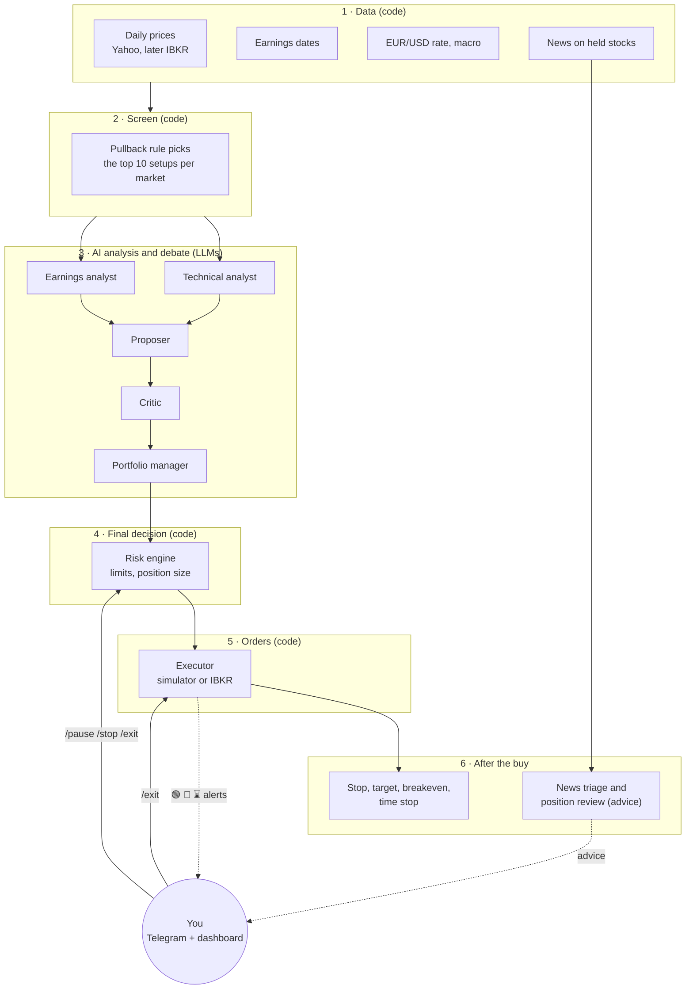
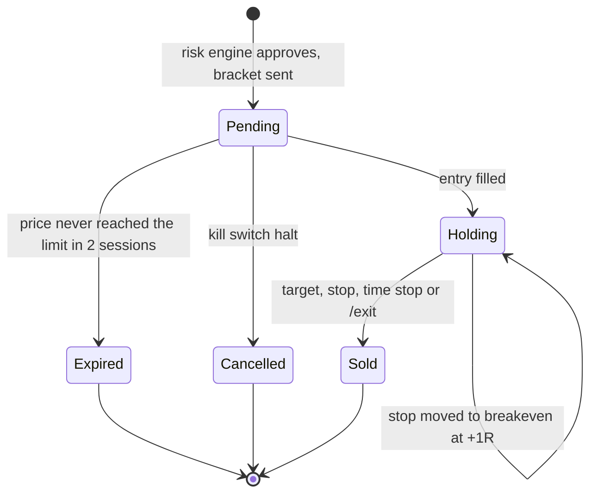
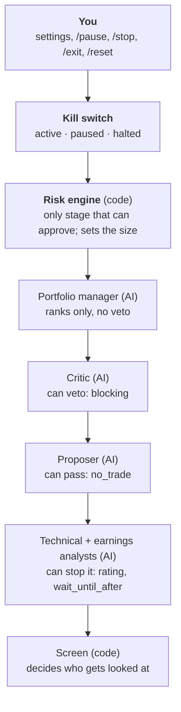

# How the Trading Agent Works

> A plain-language guide to what the system does, how it decides, and what you can change. Its design as a multi-agent system is in [MAS-DESIGN.md](MAS-DESIGN.md).
> It describes the code as of 2026-10-05 (milestones M0–M9 and the M10 preparation are built).
> [CONCEPT.md](CONCEPT.md) explains why the system is designed this way. [IMPLEMENTATION.md](IMPLEMENTATION.md) explains how it is built.
> Not financial or tax advice.

---

## Contents

1. [The short version](#1-the-short-version)
2. [Trading words used in this guide](#2-trading-words-used-in-this-guide)
3. [The big picture](#3-the-big-picture)
4. [A day in the life](#4-a-day-in-the-life)
5. [End to end: from first data to a trade](#5-end-to-end-from-first-data-to-a-trade)
6. [When does it buy?](#6-when-does-it-buy)
7. [When does it sell?](#7-when-does-it-sell)
8. [The multi-agent system](#8-the-multi-agent-system)
9. [Does it work? The three books and the go-live gate](#9-does-it-work-the-three-books-and-the-go-live-gate)
10. [Safety nets](#10-safety-nets)
11. [Your part: Telegram, dashboard, daily routine](#11-your-part-telegram-dashboard-daily-routine)
12. [Settings you can change](#12-settings-you-can-change)
13. [What the system does not do (yet)](#13-what-the-system-does-not-do-yet)

---

## 1. The short version

- The system is a **robot swing trader** for one personal account. It buys stocks it expects to rise over the next few days to three weeks, then sells them again. It never bets on falling prices (no short selling), never borrows money, and doesn't trade options.
- It watches about **140 large, liquid stocks**: the S&P 100 (US) and the DAX 40 (Germany).
- **Plain code** finds candidates with a fixed rule: "a stock in an uptrend that has dipped a little". **AI models** (LLMs) then study each candidate, argue about it, and propose a trade or pass.
- **Plain code has the final say.** A risk engine checks every proposal against hard limits and decides how many shares to buy. The AI can't place orders, choose the size, or invent prices.
- Every trade is placed with its exit already attached: a **stop** that sells if the price falls to a set level, and a **target** that sells if the price rises to a set level. They sit at the broker, so they still work if the computer is off.
- It runs on **paper** (simulated money) first. Real money (€1,000, US stocks only) comes only once the paper results beat a simple rule-based strategy after all costs, over at least 3 months and 50 trades.
- You stay in control from your phone. Telegram brings a morning briefing, alerts and an evening digest. Commands like `/pause`, `/stop` and `/exit` let you step in at any time.

---

## 2. Trading words used in this guide

| Word | Meaning |
|---|---|
| **Swing trade** | A trade held for days to a few weeks, to catch one "swing" of the price. Day trading is shorter; investing is longer. |
| **Long** | Buying a stock to sell it later at a higher price. This system only goes long. |
| **Session** | One trading day of an exchange. NYSE (US): 15:30–22:00 Berlin time. Xetra (Germany): 09:00–17:30. |
| **Daily bar** | One day's summary of a stock: open, high, low and close price, plus volume (shares traded). The system works only with daily bars, not minute-by-minute prices. |
| **Limit order** | "Buy at this price or cheaper." If the price never gets there, nothing is bought. Every entry uses one. |
| **Stop (stop-loss)** | A standing order to sell if the price falls to a set level. It caps the loss of a trade. |
| **Target (take-profit)** | A standing order to sell if the price rises to a set level. It locks in the gain. |
| **Bracket order** | Entry, stop and target sent together. When one exit fills, the broker cancels the other. |
| **Risk (R)** | What you lose if the stop is hit: (entry − stop) × shares. "1R" is that amount. Here it's at most €15 per trade. |
| **R multiple** | A result measured in units of risk. +2R means you won twice what you risked; −1R means the stop was hit. |
| **Reward to risk (R:R)** | (target − entry) ÷ (entry − stop). The system needs at least 2: the possible gain is at least twice the possible loss. |
| **Moving average (SMA, EMA)** | The average closing price over the last N days, for example SMA50 over 50 days. EMA weights recent days more. Rising averages, with the price above them, mean an **uptrend**. |
| **Pullback** | A short dip within an uptrend. Buying the dip is cheaper than buying at the top, and the stop can sit just below the dip. |
| **RSI** | Relative Strength Index, 0 to 100. Below 30 means the stock fell a lot recently ("oversold"), above 70 means it rose a lot ("overbought"). The setup wants 40–55: cooled off, but not collapsing. |
| **ATR** | Average True Range: how much the stock typically moves in a day, in currency. A stop closer than 1 ATR gets hit by normal noise. |
| **Support / resistance** | Price zones where the stock bounced (support) or stalled (resistance) before. |
| **Relative strength** | How a stock did over the last 3 months compared with its market (SPY for US, the DAX ETF for Germany). |
| **Earnings report** | A company's quarterly results. The price can jump 5–10 % overnight on them, which can skip right past a stop. The system avoids buying shortly before one. |
| **Drawdown** | How far the account has fallen from its highest value. |
| **Paper trading** | Trading with simulated money, using real prices. |
| **Slippage** | Getting a slightly worse price than planned. The simulator assumes 0.05 % per buy and per sell. |
| **Settlement** | Money from a sale arrives one business day later in the US (T+1), two in Germany (T+2). Until then it can't buy anything. |
| **Win rate, expectancy, profit factor** | Share of winning trades; average result per trade (in R or €); total gains ÷ total losses. A profit factor above 1 means it made money. |
| **Book** | A separate record of trades, as if each were its own account. The system keeps several books so they can be compared (section 9). |
| **Sleeve** | A slice of the budget. In paper mode, US and Germany each get their own simulated account: €1,000 for US and €5,000 for Germany, because German minimum fees are too high for €1,000. |
| **LLM** | Large language model, the AI behind chatbots. Here Google Gemini (and later Anthropic Claude) are used through their APIs. |

---

## 3. The big picture

What runs where:

| Part | Runs as | Uses AI? |
|---|---|---|
| Data collection, quality checks | Code | No |
| Screening for candidates | Code (fixed rules) | No |
| Analysis, proposal, critique, ranking | LLMs, checked by code after every answer | Yes |
| Risk checks and position size | Code | **Never** |
| Orders, stops, exits | Code, talking to the broker | **Never** |
| News sorting, position review | LLMs | Yes, but only advice to you |
| Briefing, digest, weekly report | Code | No |

The whole system is one Python program (the `agent` container) plus a database, a read-only dashboard and, once the IBKR login exists, the IB Gateway that talks to Interactive Brokers. It runs on the Zenbook at home.

---

## 4. A day in the life

All times are Berlin time on a normal trading day. The jobs follow the exchange calendars, so holidays and half-days are handled automatically. For a few weeks in spring and autumn the US and Europe switch to summer time on different dates, and all US times move one hour earlier.

| Time | What happens | AI? |
|---|---|---|
| every 5 min | Heartbeat ping to an outside service, which alerts you if the pings stop | |
| 07:00 | Macro data (US rates, inflation, VIX, ECB rate) | |
| 07:15 | Earnings calendar refresh | |
| 07:00–22:30, every 30 min | Latest news for stocks the agent holds, sorted by importance | ✓ |
| 08:15 | **EU scan**: screen German stocks on yesterday's prices, analyse, propose, rank; 🧠 summary in Telegram | ✓ |
| 08:30 | 📰 **Morning briefing**: markets, EUR/USD, earnings in the next 3 days, the rule-based book, data status | |
| 09:00 | Xetra opens | |
| 09:15 | **EU placement**: risk engine checks today's EU proposals; approved ones are sent as bracket orders; 📤 summary | |
| 09:00–22:50, every 10 min | Monitor: sync with IBKR, report fills (only once orders go to IBKR) | |
| 14:45 | **US scan** (as at 08:15, for US stocks) | ✓ |
| 15:30 | NYSE opens | |
| 15:45 | **US placement** (as at 09:15) | |
| 17:30 | Xetra closes | |
| 18:00 | EU closing prices, ECB exchange rate, data quality check | |
| 18:05 | **EU end of day**: fills, stop to breakeven, time stops, EU book update; 🟢 🔴 ⌛ alerts | |
| 21:00 | **Position review**: held stocks with important news or a report coming up get a second look; 🧐 if the AI thinks the reason for the trade is gone | ✓ |
| 22:00 | NYSE closes | |
| 22:30 | US closing prices, quality check | |
| 22:35 | **US end of day** (as at 18:05, for US positions) | |
| 22:40 | Reconciliation: does the broker hold what the agent thinks it holds? (once IBKR is connected) | |
| 23:00 | Rule-based book replayed with today's prices | |
| 23:05 | 🌙 **Evening digest**: today's proposals, placements and rejections, fills, labels to do, AI spend | |
| 03:15 | Database backup (host cron job, once set up) | |
| Saturday 10:00 | � **Weekly report**: results of all books, costs, calibration, go-live gate | |

Why scan before the open and place 15 minutes after it? The scan uses the last complete daily bars, which exist once the previous session has closed. Placing after the open avoids the jumpy first minutes, and a placement that runs more than 2 minutes late is skipped rather than run at a random time.

---

## 5. End to end: from first data to a trade

### Step 1: Collect data

After each close, the system downloads that day's prices for every stock in the universe. Every number is stored with its source and time. Earnings dates, EUR/USD and macro data arrive each morning. A repeated download changes nothing; a stock split rewrites the stock's whole history automatically.

### Step 2: Check the data

Quality checks look for missing days, impossible prices (for example a low above the high), jumps over 40 % (often an unrecorded split), zero volume and stale data. A stock with a problem in the last 20 sessions is marked **blocked**, and you get a ⚠️ once per newly blocked stock. The screen skips stocks without a bar for the latest session. Other blocked stocks are currently only reported, not removed from the scan (see section 13).

### Step 3: Screen for candidates (code, no AI)

The "pullback in an uptrend" rule checks every stock on the latest daily bar. All of these must be true:

| Rule | In plain words |
|---|---|
| Price above 5 (USD or EUR) | No penny stocks |
| 20-day average traded value above 20 million | Enough trading that orders fill at fair prices |
| Close above the 200-day average, and the 50-day above the 200-day | The long-term trend is up |
| The highest close of the last 20 days was 3–10 days ago | It's a fresh dip, not a new high and not a long slide |
| Close 0–3 % above the 20-day EMA or the 50-day SMA | The dip has reached a level where buyers often step in |
| RSI between 40 and 55 | Cooled off, but not collapsing |
| No earnings report in the next 3 sessions | No overnight jump risk right after buying |

The stocks that pass are ranked by **relative strength** (the strongest over 3 months first). The **top 10 per market** go to the AI (5 in lean mode, see 12.4). Of those, stocks the agent already holds get no proposal.

### Step 4: Analyse (two AI analysts)

For each candidate, code first computes all the facts: trend, moving averages, RSI, MACD, Bollinger Bands, volume, support and resistance zones, Fibonacci levels and ATR. From these it builds a **level menu**: named prices such as `ema20`, `sma50`, `swing_low_last`, `support_1`, `resistance_1`, `atr_stop_2x` or `atr_target_4x`.

- The **technical analyst** reads the facts and rates the setup (`strong_buy`, `buy`, `neutral`, `avoid`) with a draft plan. The plan names an entry, a stop and a target **from the menu**. It can't write a price of its own; an answer with a name that isn't on the menu is rejected.
- The **earnings analyst** looks at the next report and the last 8 (beat or miss, how far the price jumped). It decides whether a report falls inside the holding window (about 17 sessions) and gives a stance: no report in the window, hold through it, exit before it, or wait until after it.

After each answer, code checks it: the stop must be below the entry and the entry below the target; R:R at least 2; the stop 1–4 ATR below the entry. Any number in the text must also appear in the input, otherwise its confidence is capped at 0.5. If a check fails, the AI gets one more try with the errors explained. If it fails again, the answer is dropped.

Only `buy` and `strong_buy` ratings continue.

### Step 5: Propose (the proposer)

The proposer sees both analyses, the level menu, the rules and what the agent already holds. It answers either **`no_trade`** with a reason, or **`propose`** with:

- entry, stop and target, again chosen by name from the menu
- a **thesis**: why it should work, in 2–4 sentences
- an **invalidation**: the price action that would prove it wrong
- a **confidence**: its probability that the target is hit before the stop. With R:R 2, a coin-flip setup is about 0.35; most setups are 0.3–0.5.

It must pass if the earnings analyst said "wait until after the report". The same code checks as in step 4 apply.

### Step 6: Challenge (the critic)

A second AI, meant to come from a different company (Claude, while the others are Gemini), plays devil's advocate. Code turns the level names into prices first, so the critic sees the real R:R and stop distance. It looks for reasons **not** to trade: a thesis the facts don't support, a weakening trend, a stop inside normal noise, a target beyond resistance, an earnings report, too much of one sector, missing data.

Each objection is `minor`, `major` or `blocking`. The critic also adjusts the confidence (from −0.5 to +0.1).

- **`blocking`**: the proposal is stored as `blocked` and is never traded.
- Otherwise it stays `proposed`, with the adjusted confidence.
- If the critic fails or is unavailable, the proposal stays `proposed` and is marked "no critique".

Until an Anthropic key is set up, the critic runs on Gemini too (`LLM_DEV_OVERRIDES=true`).

### Step 7: Rank (the portfolio manager)

If two or more proposals survive, the portfolio manager puts them in order: quality first (confidence, R:R, the critic's objections), then fit (prefer sectors and markets not held yet), then diversity among the top picks. It can't drop a proposal, only rank it. If it fails, code ranks by confidence × R:R.

The proposals are stored and summed up in Telegram (🧠). This is the end of the AI part.

### Step 8: Approve and size (the risk engine, code)

15 minutes after the open, the risk engine takes **today's** proposals for that market in rank order. Older proposals are never placed. For each one it runs 9 checks; a single failure rejects the trade.

| # | Check | Passes when |
|---|---|---|
| 1 | Proposal | Its status is `proposed` (not blocked, not a pass) |
| 2 | Global | The kill switch is active (not paused or halted); in live mode the live interlock is satisfied; the market is open, outside its first 15 and last 10 minutes |
| 3 | Instrument | The market is allowed in this mode (live: US only); the stock is in the universe; price ≥ 5; average traded value ≥ 20 million; no earnings in the next 3 sessions |
| 4 | Levels | Stop < entry < target; R:R ≥ 2; stop 1–4 ATR below the entry; entry at most 1 % above the current price; the current price above the stop |
| 5 | Sizing | At least one share fits within all limits, and the position is worth at least €200 |
| 6 | Fees | Estimated buy and sell fees are at most 10 % of the money at risk |
| 7 | Portfolio | Fewer than 4 positions and pending entries; the sector stays ≤ 60 % of the budget; stocks that move together (correlation above 0.7) stay ≤ 60 % together |
| 8 | Loss limits | Today's loss < 3 %, this week's < 6 %, drawdown < 15 % of the budget |
| 9 | Rate limits | Fewer than 6 orders today; the stock isn't already held or pending |

The **position size** is the largest whole number of shares that keeps all three limits:

$$
\text{shares} = \left\lfloor \min\left(\frac{1.5\% \cdot \text{budget}}{\text{entry} - \text{stop}},\ \frac{30\% \cdot \text{budget}}{\text{entry}},\ \frac{\text{settled cash} - 10\% \cdot \text{budget}}{\text{entry}}\right) \right\rfloor
$$

In words: lose at most €15 if the stop is hit, put at most €300 into one stock, and always keep €100 in cash.

### Step 9: Place the order

An approved trade becomes a **bracket order**:

- **Entry**: buy limit at the entry price, valid until the close of the next session (2 sessions in total). If the price doesn't come down to it, the order expires (⌛) and nothing happens.
- **Stop**: sell stop, good until cancelled, active once the entry fills.
- **Target**: sell limit, good until cancelled. Stop and target are linked: when one fills, the broker cancels the other.

Prices are rounded to the exchange's price steps, always in the safe direction: entry down, stop and target up. You get a 📤 summary of what was placed and what was rejected, and why.

Today the orders go to a **simulator**. It fills them from the day's prices at the close: the entry fills if the day's low reached the limit. Once the IBKR paper login works (`IB_ORDERS_ENABLED=true`), the same orders go to the IBKR paper account.

### Step 10: Manage the position

See [section 7](#7-when-does-it-sell). Every evening the system records fills (🟢 bought, 🔴 sold), moves stops, and stores the account value for the loss limits and the dashboard.

### Worked example

A US stock closed at $100.00 and typically moves $2.50 a day (ATR). EUR/USD is 1.10, so the €1,000 budget is $1,100.

1. The screen finds it: uptrend, dipped for 5 days, now 1 % above its 20-day EMA, RSI 47.
2. The technical analyst rates it `buy`: entry `ema20` = $99.50, stop `swing_low_last` = $94.50, target `resistance_1` = $109.50.
3. The earnings analyst finds no report in the next 17 sessions.
4. The proposer agrees with that plan, confidence 0.40, invalidation "close below swing_low_last".
5. The critic notes a `minor` objection (volume is light) and lowers the confidence by 0.02.
6. The risk engine checks it:
   - R:R = (109.50 − 99.50) ÷ (99.50 − 94.50) = 10 ÷ 5 = **2.0** ✓
   - Stop distance = 5 ÷ 2.50 = **2 ATR** ✓ (allowed: 1–4)
   - Entry $99.50 is below the $100 price ✓
   - Size: risk limit $16.50 ÷ $5 = 3.3; position limit $330 ÷ $99.50 = 3.3; cash limit $990 ÷ $99.50 = 9.9 → **3 shares**
   - Position $298.50 ≈ €271 (≥ €200 ✓); at risk 3 × $5 = $15 ≈ €13.60
   - Fees about $0.75 for buy and sell, 5 % of the risk ✓ (allowed: 10 %)
7. Order: buy 3 at $99.50 limit, stop $94.50, target $109.50.

What can happen next:

| Outcome | Result |
|---|---|
| The price never dips to $99.50 within 2 sessions | ⌛ Entry expires; nothing bought |
| Bought; the price falls to $94.50 | 🔴 Sold by the stop: −$15 (−1R) plus fees ≈ −€14 |
| Bought; the price rises to $109.50 | 🔴 Sold at the target: +$30 (+2R) minus fees ≈ +€27 |
| Bought; the price reaches $104.50 (+1R), then falls back | The stop moved up to $99.50 that evening, so it sells at about the entry price: roughly zero, minus fees |
| Bought; neither stop nor target hit within 15 sessions | Sold at the next open, whatever the price |

Because a win (+2R) is twice the size of a loss (−1R), the system makes money if a bit more than one trade in three reaches its target, before costs.

---

## 6. When does it buy?

The system buys a stock only if **all** of the following are true:

1. It's in the universe (S&P 100 or DAX 40), it has a price bar for the latest session, and the agent doesn't hold it yet.
2. The rule-based screen found a pullback in an uptrend on the last daily bar, and it ranked in the top 10 of its market.
3. The technical analyst rated it `buy` or `strong_buy` with a valid plan.
4. The earnings analyst didn't say "wait until after the report".
5. The proposer proposed it.
6. The critic didn't block it.
7. The risk engine approved it the next morning, 15 minutes after the open (all 9 checks).
8. During that session or the next one, the price dipped to the entry limit.

If several proposals pass, they are placed in the portfolio manager's order until the limits are reached (4 positions, 6 orders a day, sector and cash limits).

---

## 7. When does it sell?

| Reason | How it works | Alert |
|---|---|---|
| **Target reached** | The target order at the broker sells when the price reaches it (at least 2R) | 🔴 target |
| **Stop hit** | The stop order at the broker sells when the price falls to it. If the stock opens below the stop after bad news, it sells at that worse price. | 🔴 stop |
| **Breakeven stop** | Once the daily high reaches entry + 1R, the stop is moved up to the entry price that evening. From then on the trade can't turn into a real loss (except for fees or a gap down). Stops only ever move up. | 🔴 stop |
| **Time stop** | After 15 sessions without hitting the stop or the target, it sells with a market order at the next open. Capital isn't tied up in a trade that isn't working. | 🔴 time |
| **You say so** | `/exit SYMBOL` in Telegram sells the whole position with a market order at the next open | 🔴 |

What does **not** sell automatically:

- **Kill switch** (`/stop` or a loss limit): no new entries, and all unfilled entries are cancelled. Open positions **keep** their stops and targets, so they are still protected and can still reach the target.
- **Position review** (🧐): if the AI thinks the reason for a trade no longer holds, for example after a profit warning, it tells you why and suggests `/exit SYMBOL`. The decision is yours.
- **Earnings ahead**: the system doesn't buy within 3 sessions of a report, but it doesn't sell before one either. A report within 3 sessions triggers a position review, which may advise you to exit.

---

## 8. The multi-agent system

The project is also a showcase for a **multi-agent system (MAS)**: several independent decision-makers that each do one job and together reach a decision none of them makes alone. This section explains the agents, who decides what, and what happens when one fails. The MAS design itself (architecture, communication, shared memory, coordination, trust, observability, evaluation) is in [MAS-DESIGN.md](MAS-DESIGN.md).

### 8.1 The roles

| Role | Kind | Sees | Decides | Model (`config/models.yaml`) |
|---|---|---|---|---|
| Screen | Code | Daily bars of the whole universe | Which stocks are worth a look | none |
| Technical analyst | LLM | Computed indicators and the level menu | Rating, setup quality, a draft plan | `analysis`: Gemini 3.8 Flash |
| Earnings analyst | LLM | Next report, last 8 reports and price reactions | Earnings stance | `analysis`: Gemini 3.8 Flash |
| Proposer | LLM | Both analyses, the menu, rules, holdings | Propose or pass; plan, thesis, confidence | `proposer`: Gemini 3.8 Flash |
| Critic | LLM, other vendor | The same facts plus the plan in prices | Objections, severity, confidence change | `critic`: Claude Sonnet 5.5 (Gemini until an Anthropic key exists) |
| Portfolio manager | LLM | Surviving proposals, holdings, free slots | Order of the proposals | `proposer`: Gemini 3.8 Flash |
| Risk engine | Code | Proposal, account, market facts, limits | Approve or reject; number of shares | none |
| Executor | Code | Approved orders, broker state | Places, syncs, moves stops, exits | none |
| News triage | LLM | Headlines on held stocks (as untrusted text) | `none` / `low` / `high` importance | `triage`: Gemini 3.1 Flash-Lite |
| Position reviewer | LLM | Position facts, recent news, the original thesis | `hold` or `exit` **advice** | `analysis`: Gemini 3.8 Flash |

The AI roles don't chat freely with each other. Each runs once per stock in a fixed order, and gets the previous roles' answers as input. The order is fixed by code (`pipeline.py`).

### 8.2 Who's the boss?

**The risk engine is the boss of every order, and you are the boss of the risk engine.**

Read it from the bottom up: a trade needs a "yes" at every level, and any level below the portfolio manager can stop it. The levels above can only narrow things further.

| Level | Can stop a trade? | Can force a trade? |
|---|---|---|
| Screen | Yes: a stock that isn't picked is never analysed | No |
| Analysts | Yes: a rating below `buy`, or "wait until after the report" | No |
| Proposer | Yes: `no_trade` | No |
| Critic | Yes: `blocking` | No |
| Portfolio manager | No, it can only rank. A low rank can still mean no slot is left. | No |
| Risk engine | Yes: any of 9 checks | It approves, but only what the AI proposed, and only within the limits |
| Kill switch | Yes: paused or halted means no new entries | No |
| You | Yes: `/pause`, `/stop`, settings | No: there is no manual buy command. `/exit` is the only manual order. |

Why it is built this way:

- **The AI never touches money directly.** Code checks enforce it: the AI code can't even import the order code. The AI returns data; code turns it into an order only after the risk engine says yes.
- **The AI never invents prices.** It picks names from a menu of prices that code computed from real data. Code turns the names back into prices.
- **The AI never decides the size.** The number of shares comes only from the risk engine's formula.
- **Two vendors.** The critic should come from a different company than the proposer, so the two are less likely to make the same mistake.
- **News is treated as data, never as instructions.** A manipulated article saying "buy XYZ now" can't make the system do anything. News only reaches the advisory roles, and its text is wrapped and labelled as untrusted.

### 8.3 What happens when something fails

| Failure | Effect |
|---|---|
| The technical analyst's or the proposer's answer fails the checks twice | That stock is skipped today |
| The critic fails | The proposal stays, marked "no critique" |
| The portfolio manager fails | Code ranks by confidence × R:R |
| The AI budget is used up (100 %) | No more AI calls this month, so no new agent trades. The rule-based book keeps running. |
| Prices for a stock look wrong | ⚠️ alert and the stock is listed as blocked; a stock without today's bar is skipped |
| The agent or the computer is down | Stops and targets are already at the broker (once on IBKR). Missed jobs run once when it's back, if they're still useful; a late order placement is skipped. |

---

## 9. Does it work? The three books and the go-live gate

Nobody knows yet whether the AI adds value. Public studies of AI trading agents are sobering, and the rule-based strategy alone showed **no edge** in a 5-year backtest: roughly break-even before costs, slightly negative after fees, far behind simply holding the index ([IMPLEMENTATION.md](IMPLEMENTATION.md) 6.3). So the system measures itself against simpler alternatives.

| Book | What it is | Purpose |
|---|---|---|
| `baseline_sim` | The rule-based screen trading on its own: no AI, same limits and fees, simulated | The bar the AI must beat |
| `agent_paper` | The full pipeline with the risk engine; simulator now, IBKR paper account later | The real thing |
| `agent_shadow` | Every proposal the risk engine would approve if the account were empty, each simulated on its own | More trades for statistics. With only 4 slots, the real book alone would take far too long. |
| Benchmarks | Buy and hold SPY (US) and the DAX ETF (Germany) | Context: was it worth the effort at all? |
| `agent_live` | Later: real money | |

**Go-live gate** (checked in every weekly report, all four must pass):

1. At least 91 days of paper trading
2. At least 50 closed trades (`agent_paper` plus `agent_shadow`)
3. Positive average result per trade **after fees and after AI costs**
4. Better average result than `baseline_sim`

If the AI doesn't beat the rules, it shouldn't pick trades; it would then only write briefings.

The weekly report also checks **calibration**: do proposals with 40 % confidence win about 40 % of the time? And it compares your agree/disagree labels (`/review`) with the outcomes.

---

## 10. Safety nets

| Safety net | What it does |
|---|---|
| **Stops at the broker** | Every position has a stop and a target at the broker from the moment it's bought, so a crash, a power cut or a reboot never leaves a position unprotected (once orders go to IBKR). |
| **Hard limits in code** | €15 risk per trade, €300 per position, 4 positions, €100 cash reserve, sector and correlation caps, 6 orders a day. AI output can't change them. |
| **Loss limits** | Down 3 % today: no new entries until midnight. Down 6 % this week: none until Monday. Down 15 % from the peak: **halt** (see below). Checked whenever a new trade is about to be placed. |
| **Kill switch** | Three states: **active** (normal), **paused** (no new entries; via `/pause` or a daily or weekly loss limit), **halted** (no new entries, all unfilled entries cancelled; via `/stop`, the drawdown limit or a reconciliation mismatch). |
| **Reset needs two keys** | A halt only ends with a code printed on the host (`trading-agent reset`), sent from your phone with `/reset CODE` within 15 minutes. A reset needs both the host and your phone. |
| **Reconciliation** | Compares the broker's positions with the agent's records after each US close and after every reconnect. Any difference halts the agent. |
| **Live interlock** | Real money needs three things at once: `APP_MODE=live`, a live IBKR login, and `/confirm_live CODE` with a code from the host logs after every start. Without all three, no orders. Paper mode on a live login is refused too. |
| **AI budget** | Monthly cap of $16 (about €15). Fewer candidates above 80 %, no calls at 100 %. A model without a known price is never called. |
| **Owner-only Telegram** | Messages from any other chat are ignored and logged. Messages never contain account numbers or passwords. |
| **Read-only dashboard** | It can't change anything, uses a read-only database login, and is reachable only through your Tailscale network. |
| **Heartbeat** | An outside service alerts you if the agent stops pinging. |
| **Backups** | Nightly database dump, a weekly encrypted copy for off-site storage, and a tested restore. |
| **Audit trail** | Every AI prompt and answer, every risk decision with all checks, every order change and every kill-switch change is stored. |

---

## 11. Your part: Telegram, dashboard, daily routine

### 11.1 Telegram commands

| Command | What it does |
|---|---|
| `/status` | Mode, kill switch, uptime, heartbeat, latest data, blocked stocks, next jobs, IBKR connection |
| `/briefing` | The morning briefing, now |
| `/budget` | AI spend this month and the budget mode |
| `/proposals` | The latest proposals and their status |
| `/why SYMBOL` | Thesis, critique and plan for one proposal |
| `/review` | Steps through the latest proposals with Agree / Disagree / Skip buttons; reply with a reason if you like. Labels are only used for evaluation and never change a trade. |
| `/positions` | Open positions (entry, stop, target, last close, R, P&L) and pending entries |
| `/pnl` | Results for the day, week, month and since the start, with the rule-based book for comparison |
| `/exit SYMBOL` | Sell that position at the next open (market order) |
| `/pause [reason]` | No new entries until `/resume` |
| `/resume` | Allow new entries again |
| `/stop` | Kill switch: halt (asks for confirmation) |
| `/reset CODE` | End a halt, with the code from `trading-agent reset` on the host |
| `/confirm_live CODE` | Live mode only: allow orders after a start |
| `/help` | The command list |

### 11.2 Messages you'll get

| Icon | When |
|---|---|
| ▶️ ⏹ | The agent started or is stopping |
| 🧠 | Scan result: ranked proposals, blocked ones and passes, AI cost |
| 📰 | Morning briefing; or important news on a held stock |
| 📤 | Placement: what was ordered and what the risk engine rejected, and why |
| 🟢 | A buy filled |
| 🔴 | A position was sold (target, stop, time stop or `/exit`) |
| ⌛ | An entry expired or was cancelled |
| 🧐 | Position review: the AI thinks the reason for a trade is gone, with `/exit SYMBOL` |
| 🌙 | Evening digest |
| � | Weekly report with the go-live gate |
| 📊 | Answer to `/positions` |
| ⏸ ⛔ ▶️ | Kill switch paused, halted, or entries allowed again (also after a loss limit) |
| ⚠️ | Data problem, failed or missed job, reconciliation mismatch |
| 🔌 | IB Gateway disconnected for more than 10 minutes, and again when it's back |
| 🔐 | Live mode: confirm with `/confirm_live CODE` |

### 11.3 Dashboard

Open it on your phone or Mac through Tailscale. Pages: **Overview** (positions, P&L, AI spend, results per book, data freshness), **Positions**, **Proposals** (with plan, critique and your label), **Journal** (closed trades), **Analyses** (every AI answer in full), **Costs** (AI and broker fees), **Risk** (limit usage, correlation heatmap, rejections), **Evaluation** (go-live gate, calibration, label accuracy) and **Reports** (weekly reports).

### 11.4 Daily routine (about 1 hour)

- **Morning, 10 minutes**: read the briefing and the 🧠 EU proposals. Anything you strongly disagree with? `/pause` stops the placement at 09:15.
- **Evening, 30–60 minutes**: read the digest. `/review` the day's proposals: agree or disagree, with a short reason. Check any 🧐 advice and decide on `/exit`.
- **Saturday, 1 hour**: read the weekly report. Which lessons should change a prompt or a rule? Changes are versioned and need a reason.

---

## 12. Settings you can change

### 12.1 How to change a setting

- **Files in `config/` and `prompts/`** are part of the code and built into the Docker image. Change them on the Mac, commit, push, then `make deploy` (or on the Zenbook: `git pull && make build && make up`). The agent reads them at start.
- **`.env`** lives only on the Zenbook. Edit it there, then `docker compose up -d` (a plain `restart` doesn't re-read `.env`).
- Change things outside trading sessions, or `/pause` first.
- **`config/risk.yaml` needs extra care**: every change gets its own commit with a reason, never mixed with other changes. Unknown or invalid keys stop the agent from starting, so a typo can't silently turn off a limit.

### 12.2 `.env`: switches and keys

| Setting | Current | What it does |
|---|---|---|
| `APP_MODE` | `paper` | `paper` or `live`. Live also needs a live IBKR login and `/confirm_live`. In live mode only `markets.live` is traded, with the real `agent_budget_eur`. |
| `IB_ENABLED` | `false` | `true`: connect to the IB Gateway (read-only at first), use IBKR contract data and quotes, reconcile positions |
| `IB_ORDERS_ENABLED` | `false` | `true`: orders go to IBKR instead of the simulator. Needs `IB_ENABLED=true` and `IB_READ_ONLY_API=no`. Switch only when no `agent_paper` positions are open. |
| `IB_READ_ONLY_API` | `yes` | The gateway's own lock: `yes` refuses all orders |
| `COMPOSE_PROFILES` | empty | `ibkr`: also start the IB Gateway container |
| `TWS_USERID`, `IB_HOST`, `IB_PORT`, `IB_CLIENT_ID` | | IBKR login name and connection. Port 4004 is paper, 4003 live. |
| `LLM_DEV_OVERRIDES` | `true` | `true`: the critic runs on Gemini (`dev_overrides` in `models.yaml`). `false` once an Anthropic key exists. |
| `GEMINI_API_KEY`, `ANTHROPIC_API_KEY` | | AI provider keys. Without a key, that provider's roles can't run. |
| `TELEGRAM_BOT_TOKEN`, `TELEGRAM_OWNER_CHAT_ID` | | Your bot and your chat. Without the chat id, every message is ignored. |
| `FRED_API_KEY` | | US macro data; skipped without it |
| `FINNHUB_API_KEY` | | News for held US positions; without it, no news triage and fewer position reviews |
| `SEC_EDGAR_USER_AGENT` | | Required by the SEC for filings data (not used yet) |
| `HEARTBEAT_URL`, `BACKUP_HEARTBEAT_URL` | | Outside health checks for the agent and the backup |
| `BACKUP_AGE_RECIPIENT` | | Public key for the encrypted weekly backup copy |
| `LOG_LEVEL`, `TZ`, `DB_*` | | Logging detail, time zone, database connection; the defaults work |

### 12.3 `config/risk.yaml`: the hard limits

The risk engine reads this file. "Budget" means the sleeve's budget: in paper mode €1,000 for US and €5,000 for Germany; in live mode `agent_budget_eur`.

**Capital**

| Setting | Current | What it does |
|---|---|---|
| `capital.agent_budget_eur` | 1000 | The money the agent may use, whatever the account really holds. All percentages below are of this amount. |
| `capital.min_cash_reserve_pct` | 10 | Cash that is never spent (€100) |
| `capital.paper_budget_eur` | EU: 5000 | Paper only: a separate simulated budget per market. Germany gets €5,000 because its minimum fees make €1,000 trades fail the fee check. |

**Per trade**

| Setting | Current | What it does | Higher means |
|---|---|---|---|
| `per_trade.max_risk_pct` | 1.5 | Most you can lose on one trade if the stop holds (€15) | Bigger positions, bigger losses per trade |
| `per_trade.max_position_pct` | 30 | Most money in one stock (€300) | Fewer, larger positions; more expensive stocks become buyable |
| `per_trade.min_position_eur` | 200 | Smallest position worth the fees | Fewer small trades |
| `per_trade.max_fee_to_risk_pct` | 10 | Reject if buy and sell fees exceed this share of the risk | More trades where fees eat the profit |
| `per_trade.min_risk_reward` | 2.0 | Minimum (target − entry) ÷ (entry − stop). The AI is told this rule too. | Fewer trades with bigger targets, which are hit less often |
| `per_trade.stop_atr_min` / `stop_atr_max` | 1.0 / 4.0 | Allowed stop distance in ATRs. Below 1 the stop sits in normal daily noise; above 4 the position gets very small. | |
| `per_trade.max_limit_deviation_pct` | 1.0 | The entry may be at most this much above the current price (any distance below is fine; it may simply not fill) | Allows chasing the price |
| `per_trade.require_broker_side_stop`, `order_type`, `execution.routing` | true, limit_only, smart | Fixed design rules; only these values are accepted | |

**Portfolio**

| Setting | Current | What it does |
|---|---|---|
| `portfolio.max_open_positions` | 4 | Positions plus pending entries at the same time |
| `portfolio.max_sector_pct` | 60 | Most of the budget in one sector, for example technology |
| `portfolio.max_correlated_cluster_pct` | 60 | Most of the budget in stocks that move together (correlation of daily returns above 0.7 over 60 sessions). A stock without enough history counts as correlated. |

**Loss limits** (only stop new entries; open positions keep their stops)

| Setting | Current | What it does |
|---|---|---|
| `loss_limits.daily_loss_pct` | 3 | Down €30 today: paused until midnight |
| `loss_limits.weekly_loss_pct` | 6 | Down €60 this week: paused until Monday |
| `loss_limits.max_drawdown_pct` | 15 | Down €150 from the highest account value: halted until you reset. In paper, a halt in any sleeve halts everything. |

**Markets, instruments, execution**

| Setting | Current | What it does |
|---|---|---|
| `markets.paper` / `markets.live` | [US, EU] / [US] | Markets that may be traded in each mode |
| `instruments.min_price` | 5 | Lowest share price |
| `instruments.min_avg_daily_dollar_volume` | 20,000,000 | Lowest 20-day average traded value, in the stock's currency |
| `execution.max_orders_per_day` | 6 | New brackets per day, across the whole book |
| `execution.no_trading_first_minutes` / `last_minutes` | 15 / 10 | No new entries this close to the open or close |
| `execution.no_new_entries_before_earnings_days` | 3 | No new entry if a report is this many sessions away or fewer |

**Kept for later; changing them has no effect yet**: `options.*` (options aren't built), `instruments.universe_us`, `universe_eu`, `etfs` and `blacklist` (the universe comes from `universe.yaml`), and `costs.llm_budget_eur_month` (the active AI budget is in `models.yaml`).

### 12.4 `config/models.yaml`: AI models and budget

| Setting | Current | What it does |
|---|---|---|
| `roles.triage` | Gemini 3.1 Flash-Lite | News sorting (cheap and fast) |
| `roles.analysis` | Gemini 3.8 Flash | Technical and earnings analysts, position review |
| `roles.proposer` | Gemini 3.8 Flash | Proposer and portfolio manager |
| `roles.critic` | Claude Sonnet 5.5 | Critic; needs `ANTHROPIC_API_KEY` and a price below |
| `roles.reports` | Gemini 3.8 Flash | Reserved for AI-written reports (the current reports use no AI) |
| `dev_overrides.critic` | Gemini 3.8 Flash | Used instead while `LLM_DEV_OVERRIDES=true` |
| `prices` | per model | Price per million tokens, used to estimate costs. **A model without a price is never called.** |
| `budget.monthly_usd` | 16 | The monthly AI budget (about €15) |
| `budget.lean_mode_at` | 0.8 | From 80 % spent: lean mode, fewer candidates per scan |
| `budget.hard_stop_at` | 1.0 | From 100 %: no more AI calls this month |
| `rate_limits_rpm` | 10 / 15 | Calls per minute per model, to stay inside the free tier |
| `scan.candidates` / `candidates_lean` | 10 / 5 | Candidates analysed per market and scan, normally and in lean mode. The biggest lever on AI cost. |

### 12.5 `config/strategies.yaml`: the screen and trade management

These rules pick the candidates for the AI **and** run the rule-based book. The last four also manage every `agent_paper` position.

| Setting | Current | What it does |
|---|---|---|
| `min_price`, `min_avg_dollar_volume`, `avg_volume_sessions` | 5, 20 M, 20 | Price and liquidity floor of the screen |
| `high_lookback`, `pullback_sessions` | 20, [3, 10] | The pullback must start from the highest close of the last 20 days, 3–10 days ago |
| `ma_band_pct` | [0, 3] | Close 0–3 % above the EMA20 or SMA50 |
| `rsi_range` | [40, 55] | RSI window |
| `earnings_buffer_sessions` | 3 | No report this close |
| `rs_window` | 63 | Ranking: 3-month return against the market |
| `entry_offset_pct`, `swing_lookback`, `swing_window`, `stop_swing_atr`, `stop_atr`, `target_r` | 0.2, 5, 60, 0.5, 2.0, 2.0 | The rule-based book's own entry, stop and target (entry = close + 0.2 %; stop = lower of last swing low − 0.5 ATR and entry − 2 ATR; target = 2R). The AI picks its own levels instead. |
| `entry_valid_sessions` | 2 | How long a buy limit stays open (also for the agent) |
| `breakeven_r` | 1.0 | Move the stop to the entry price at +1R (also for the agent) |
| `time_stop_sessions` | 15 | Sell after this many sessions (also for the agent) |
| `slippage_pct` | 0.05 | Simulated price disadvantage per buy and per sell |
| `baseline_book.start` | 2026-10-05 | First day of the rule-based book |

The baseline is deliberately **not tuned** on past data; it's the fixed bar the AI has to beat. Changing it changes the comparison, so do it rarely and note why.

### 12.6 `config/schedule.yaml`: when jobs run

Each job runs either at a clock time (`cron`, Berlin time) or relative to an exchange's open or close (`calendar`, `anchor`, `offset_minutes`). `misfire_grace_minutes` is how late a job may still run after a downtime; later than that, it is skipped. The table in [section 4](#4-a-day-in-the-life) shows the current times. Keep the order intact: prices before the end-of-day job, scan before placement, and placement inside the trading window.

### 12.7 `config/fees.yaml`, `config/data.yaml`, `config/universe.yaml`

| File | What it controls |
|---|---|
| `fees.yaml` | IBKR commissions per market (Tiered or Fixed plan, minimums, exchange and regulatory fees). Used for the fee check and for every simulated trade. Compare with the first real statements. |
| `data.yaml` | Price history length (6 years), price source per market (`yahoo`, later `ibkr`), macro series, quality thresholds (jump size, stale days, how long a problem blocks a stock) |
| `universe.yaml` | The stocks that are watched, with sector and currency, plus the two benchmark ETFs. Generated by `scripts/build_universe.py` from the index member lists; don't edit it by hand. A larger universe (S&P 500, MDAX) means more candidates and more AI cost. |

### 12.8 `prompts/`

The instructions for each AI role, one file per version (`prompts/proposer/v1.md`). A change becomes a new version, so the weekly report can compare results before and after. Every stored AI answer records the prompt version and model it used.

---

## 13. What the system does not do (yet)

- **No short selling, no margin, no options.** Only buying shares with cash.
- **No intraday trading.** Decisions use daily bars; stops and targets at the broker react during the day, but breakeven and time stops are set in the evening.
- **No trailing stop** beyond the one move to breakeven.
- **No automatic sale on bad news or before earnings.** The position review advises; you decide with `/exit`.
- **Macro data is collected but not used** in decisions yet. Company fundamentals (revenue, valuation) aren't used either.
- **News covers held US stocks only** (Finnhub's free tier).
- **The 1 % entry check uses the last close** until the IBKR gateway delivers live quotes.
- **Paper fills are simulated from daily bars** until the IBKR paper login is set up (runbook in [IMPLEMENTATION.md](IMPLEMENTATION.md) 15.5).
- **The rule-based book doesn't apply the correlation and loss limits** that the agent's risk engine applies.
- **Blocked stocks still reach the scan.** The quality check reports them ("excluded from today's scan"), but the candidate list only drops stocks whose latest bar is missing. A stock with, say, a suspicious price jump can still be analysed and traded.
- **No proven edge.** The whole point of the paper phase is to find out whether there is one.
