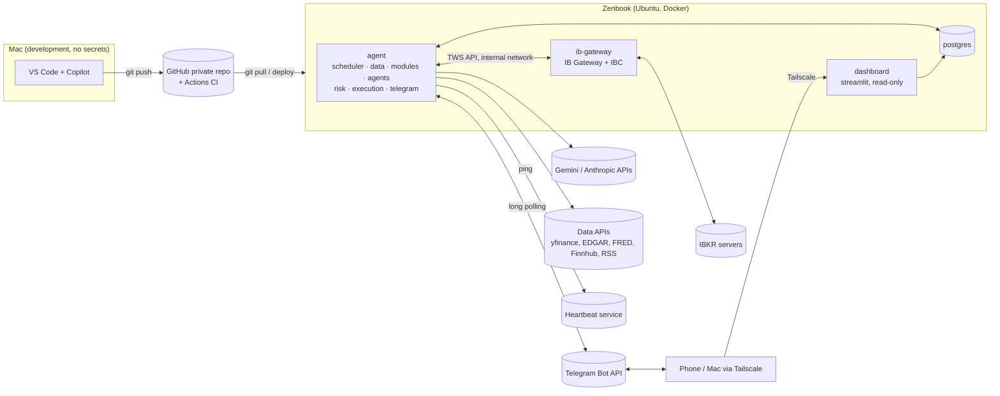
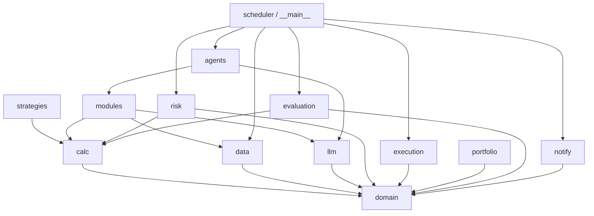
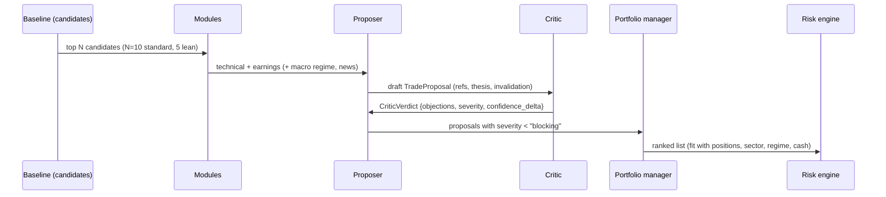
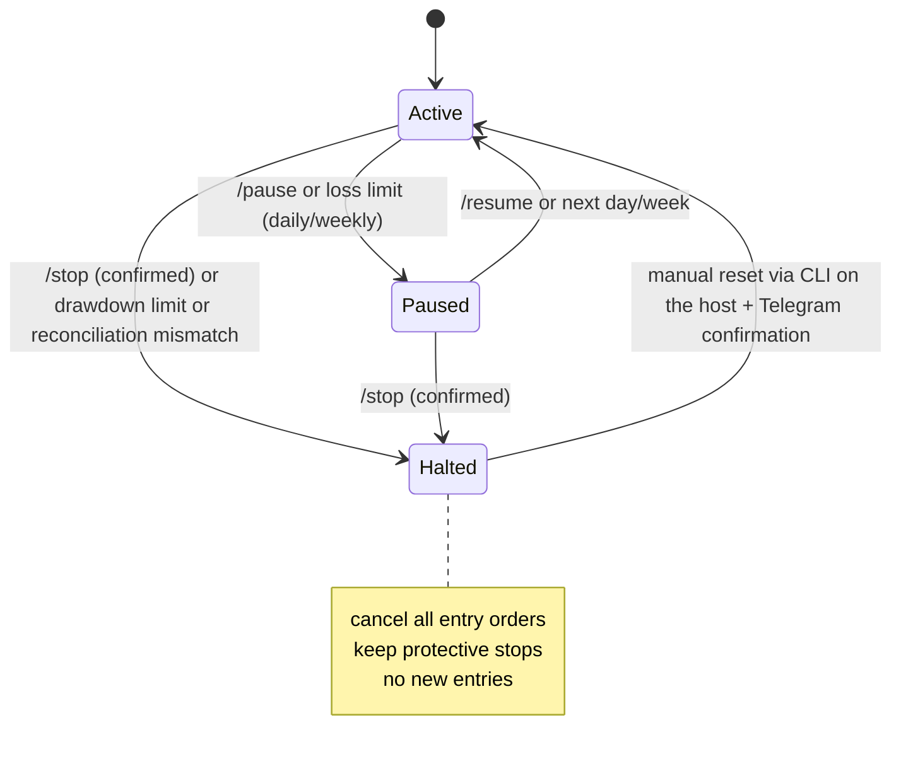
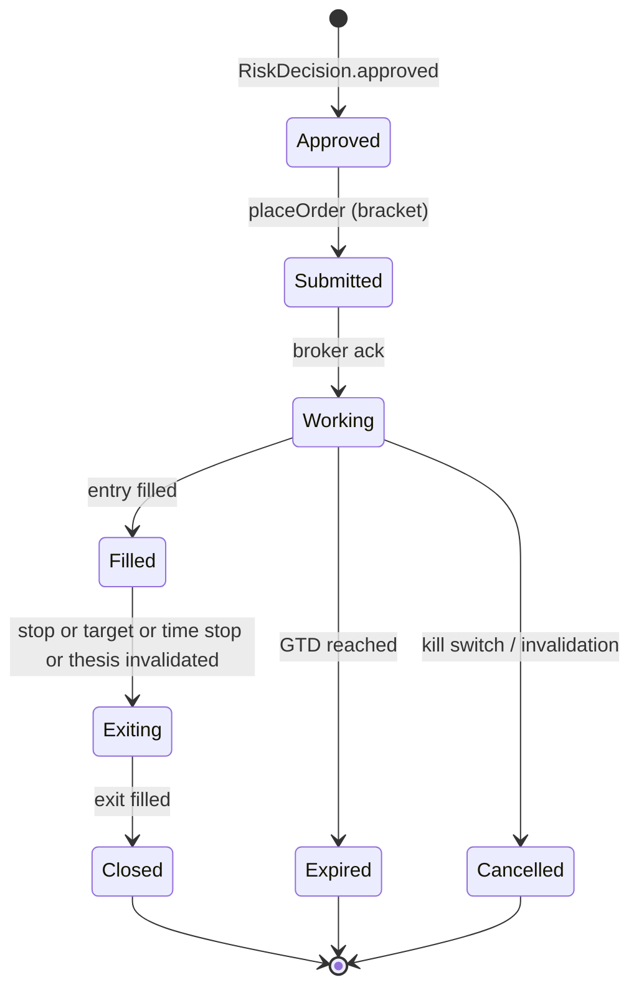
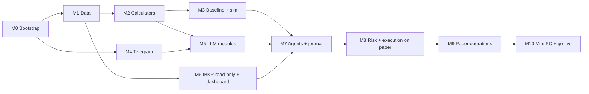

# Trading Agent – Implementation Concept

> Status: Draft v0.2 (2026-10-03). Open questions from v0.1 answered (section 19); milestone M0 started.
> Builds on [CONCEPT.md](CONCEPT.md) v0.2. CONCEPT.md explains *what* the system does and *why*. This document explains *how* it is built.
> Disclaimer: technical concept, not financial or tax advice.

---

## 1. Fixed decisions

| Area | Decision |
|---|---|
| Runtime host (paper phase) | Asus Zenbook UX301LA: Ubuntu LTS, x86_64, 8 GB RAM, always plugged in |
| Runtime host (live phase) | x86_64 mini PC with 8–16 GB RAM and an SSD. Same stack, moved over. |
| Development | VS Code on the Mac, **code only, no secrets**. Pushed to the private GitHub repo `klausrossmann/trading-agent` and pulled on the Zenbook. |
| Who writes the code | Copilot writes most of it, including tests. You review every change and make the architecture decisions (section 16.1). |
| Language and tooling | Python 3.13, `uv` (environments and lockfile), `ruff`, `pyright`, `pytest`, `hypothesis`, `import-linter` |
| Broker | IBKR cash account; IB Gateway in Docker (`gnzsnz/ib-gateway`) plus `ib_async` |
| LLM | PydanticAI (2.x) with Gemini (workhorse) and Claude Sonnet (critic). LiteLLM isn't needed because PydanticAI already switches providers through a model string. |
| Notifications | Telegram bot (`python-telegram-bot` 22.x), long polling, restricted to your chat ID |
| Database | PostgreSQL 17. TimescaleDB isn't needed: about 600 symbols × 10 years of daily bars is only a few million rows. |
| Scheduling | APScheduler 3.x (`AsyncIOScheduler`); jobs are anchored to exchange sessions with `exchange_calendars` |
| Dashboard | Streamlit, read-only database role, reachable only through Tailscale |
| LLM tracing | Local only: `llm_calls`, `audit_log` and structured JSON logs. Hosted Pydantic Logfire is not used for now (section 19). |
| Starting universe | S&P 100 + DAX 40 (about 140 symbols). S&P 500, Nasdaq-100 and MDAX are added once scans are stable and cheap. |
| Architecture style | Modular monolith: a single async Python process with strict package boundaries |

Why Telegram instead of Signal: your Signal number belongs to your personal account. A number can have only one primary device, so registering it in `signal-cli` would sign your phone out. Telegram's official Bot API needs no extra number, supports buttons for confirmations, and works over outbound polling only. The trade-off is that bot chats are not end-to-end encrypted, so messages never contain account IDs or credentials (section 13).

---

## 2. System topology



### 2.1 Containers

| Container | Image | Networks | Published ports | Holds secrets |
|---|---|---|---|---|
| `ib-gateway` | `ghcr.io/gnzsnz/ib-gateway:stable` | `egress`, `backend` | VNC `127.0.0.1:5900` only, for maintenance through an SSH tunnel | IBKR username and password (Docker secret) |
| `db` | `postgres:17` | `backend` (internal) | none | DB passwords |
| `agent` | own image | `backend`, `egress` | none | API keys, Telegram token, DB URL |
| `dashboard` | own image (same image, different command) | `backend` (internal) | `127.0.0.1:8501`, exposed through `tailscale serve` | read-only DB URL |

The TWS API port (4004 for paper) is reachable only from inside the Compose network. It is never published, because the protocol is unauthenticated and unencrypted. The Python code never sees the IBKR password; only the gateway container logs in.

### 2.2 Memory budget (8 GB)

| Component | Estimate |
|---|---|
| Ubuntu (minimal desktop or server) | 1.0–1.5 GB |
| IB Gateway (JVM, default heap 768 MB) | 1.0–1.5 GB |
| PostgreSQL (`shared_buffers=256MB`) | 0.3–0.5 GB |
| agent (pandas, async clients) | 0.4–0.8 GB |
| dashboard (Streamlit) | 0.2–0.3 GB |
| **Total** | **≈ 3–4.5 GB**, leaving headroom; add a 4 GB swap file as a safety net |

---

## 3. Code architecture

### 3.1 Repository layout

```
trading-agent/
├── CONCEPT.md / IMPLEMENTATION.md
├── pyproject.toml / uv.lock
├── Dockerfile
├── compose.yaml                 # production-like stack (Zenbook, mini PC)
├── compose.dev.yaml             # Mac: db + agent with fake broker and test models
├── .env.example                 # documented keys, no values
├── Makefile                     # lint, test, deploy, backup, migrate
├── config/
│   ├── risk.yaml                # from CONCEPT.md 6.1
│   ├── universe.yaml            # generated by a script, refreshed monthly
│   ├── schedule.yaml            # jobs relative to session open/close
│   ├── models.yaml              # LLM role → model, budget
│   └── fees.yaml                # IBKR commission model per market
├── prompts/
│   └── <module>/v<N>.md         # front matter: version, role, output schema
├── migrations/                  # alembic
├── scripts/                     # build_universe.py, backfill.py, one-offs
├── src/trading_agent/
│   ├── __main__.py              # CLI (typer): run, backfill, scan, backtest, report, killswitch
│   ├── settings.py              # pydantic-settings, loads .env + config/*.yaml
│   ├── domain/                  # pure models, no I/O
│   ├── db/                      # SQLAlchemy models, repositories
│   ├── data/                    # providers + ingestion jobs
│   ├── calc/                    # indicators, levels, stats, fees, sizing
│   ├── strategies/              # rule-based baseline (candidate generator)
│   ├── modules/                 # analysis modules (data → calc → LLM → schema)
│   ├── llm/                     # model registry, budget guard, prompt loader, sanitizer, validators
│   ├── agents/                  # proposer, critic, portfolio manager
│   ├── risk/                    # risk engine, kill switch, state
│   ├── execution/               # BrokerAdapter, IBKR adapter, simulator, reconciliation, order FSM
│   ├── portfolio/               # ledger, P&L in EUR, tax report
│   ├── evaluation/              # books, shadow tracking, KPIs, weekly report
│   ├── notify/                  # telegram bot, message templates
│   ├── scheduler.py             # job wiring
│   └── dashboard/               # streamlit pages
└── tests/
    ├── unit/                    # calc, risk, sizing, fees, FSM, validators
    ├── contract/                # adapters against recorded responses
    ├── integration/             # against the IBKR paper gateway (marker: ibkr, manual)
    ├── evals/                   # LLM golden cases (marker: llm, weekly)
    └── fixtures/                # recorded bars, chains, LLM outputs
```

### 3.2 Dependency rules (enforced with `import-linter` in CI)



Contracts:
- `llm`, `modules` and `agents` **must not import** `execution` or `risk`. LLM code can only return data objects; it has no path to an order.
- `risk` must not import `llm`. The risk engine is deterministic.
- `execution` is called only from the orchestration layer (`scheduler`, `__main__`), and only with a `RiskApproved` object. That type can only be constructed by `risk.engine`.

### 3.3 Concurrency model

There is one asyncio event loop, shared by:
- `ib_async` (`await ib.connectAsync(...)`)
- `python-telegram-bot`, using the manual lifecycle (`await app.initialize(); await app.start(); await app.updater.start_polling()`) instead of `run_polling()`, so it doesn't take over the loop
- APScheduler's `AsyncIOScheduler`
- PydanticAI's async `agent.run(...)`
- SQLAlchemy async with `asyncpg`

CPU-heavy work, such as indicators over the whole universe, runs in a thread pool (`asyncio.to_thread`) so the loop stays responsive to broker events.

---

## 4. Domain model and database

### 4.1 Core domain types (`domain/`)

```python
class Instrument(BaseModel):
    id: int
    symbol: str
    exchange: str            # "SMART"/"NASDAQ" for US, "IBIS" (Xetra) for DE
    currency: Literal["USD", "EUR"]
    conid: int | None        # IBKR contract id, resolved once
    sector: str | None
    market: Literal["US", "EU"]

class LevelRef(BaseModel):
    name: str                # e.g. "sma50", "swing_low_1", "fib_618", "atr_stop_2x"
    price: Decimal

class TradeProposal(BaseModel):
    id: UUID
    instrument_id: int
    direction: Literal["long"]           # long-only in a cash account
    strategy: str
    entry_ref: str                       # names from the level menu, never raw numbers
    stop_ref: str
    target_ref: str
    confidence: float = Field(ge=0, le=1)
    thesis: str
    invalidation: str
    evidence: list[UUID]                 # analysis ids
    data_gaps: list[str]
    prompt_versions: dict[str, str]
    model_versions: dict[str, str]

class RiskDecision(BaseModel):
    proposal_id: UUID
    approved: bool
    checks: list[CheckResult]            # every check with value, limit, pass/fail
    quantity: Decimal | None
    entry: Decimal | None
    stop: Decimal | None
    target: Decimal | None
    risk_eur: Decimal | None
    est_fees_eur: Decimal | None
```

The key idea: **the LLM chooses among named levels; code turns names into prices.** Each module receives a *level menu* (moving averages, swing highs and lows, Fibonacci levels, ATR-based stops) that the calculators produce. Output fields are `Literal` types built dynamically from that menu, so the model cannot invent a price.

### 4.2 Tables

| Table | Purpose | Key columns |
|---|---|---|
| `instruments` | Universe | `symbol`, `yahoo_symbol` (unique), `name`, `exchange`, `currency`, `kind` (`stock`/`etf`), `market`, `sector`, `indices[]`, `conid`, `active` |
| `bars_daily` | OHLCV, split-adjusted | PK (`instrument_id`, `date`), `source`, `fetched_at` |
| `fx_daily` | EUR/USD for P&L and tax | PK (`date`, `quote`), `rate` (units per 1 EUR), `source` (ECB) |
| `fundamentals` | Point-in-time facts | `instrument_id`, `period_end`, `filed_at`, `metric`, `value` |
| `earnings_events` | Calendar and history | PK (`instrument_id`, `date`), `ts`, `timing` (`bmo`/`during`/`amc`/`unknown`), `eps_estimate`, `eps_actual` |
| `news_items` | Raw news, triaged | `published_at`, `source`, `url`, `title`, `symbols[]`, `triage_score` |
| `macro_series` | FRED/ECB series | `series_id`, `date`, `value` |
| `analyses` | Module outputs | `module`, `prompt_version`, `model`, `instrument_id`, `as_of`, `input_hash`, `output jsonb`, `cost_usd` |
| `proposals` | All proposals | `payload jsonb`, `status`, `source` (`baseline` / `agent`) |
| `risk_decisions` | Risk engine verdicts | `proposal_id`, `approved`, `checks jsonb`, `quantity`, `risk_eur` |
| `orders` | Broker orders | `client_ref` (unique), `broker_order_id`, `parent_ref`, `kind` (`entry`/`stop`/`target`), `status`, `mode` (`paper`/`live`/`sim`) |
| `fills` | Executions | `order_id`, `ts`, `qty`, `price`, `commission`, `currency`, `fx_rate_eur` |
| `trades` | Round trips | `book` (`baseline_sim`, `agent_paper`, `agent_shadow`, `agent_live`), entry/exit, `pnl_net_eur`, `r_multiple`, `holding_days` |
| `llm_calls` | Cost and audit | `role`, `model`, `tokens_in/out`, `cost_usd`, `latency_ms`, `analysis_id` |
| `user_labels` | Your agree/disagree labels | `proposal_id`, `label`, `reason` |
| `agent_state` | Runtime state | key/value: `mode`, `kill_switch`, `paused`, `llm_budget_used` |
| `audit_log` | Append-only | `ts`, `actor`, `event`, `payload jsonb` |

Two DB roles: `agent` (read/write) and `dashboard` (read-only, `SELECT` only).

---

## 5. Data layer

| Data | Phase 0–1 source | Phase 2+ source | Refresh |
|---|---|---|---|
| Universe lists (start: S&P 100, DAX 40; later: S&P 500, Nasdaq-100, MDAX) | `scripts/build_universe.py` (Wikipedia constituent tables, every symbol verified on Yahoo) → `config/universe.yaml`, committed | same | monthly, on the Mac |
| Benchmarks | SPY (US), EXS1.DE (iShares Core DAX UCITS ETF) in `universe.yaml` | same | with bars |
| Daily bars US | `yfinance` | IBKR `reqHistoricalData` (daily, incremental) | XNYS close + 30 min |
| Daily bars EU (`.DE`, Xetra) | `yfinance` | IBKR | XETR close + 30 min |
| Earnings calendar and surprises | `yfinance` (covers US and DAX; ~24 events per symbol on backfill) | same, or Finnhub if coverage degrades | daily 07:15 |
| US fundamentals | SEC EDGAR company facts (as filed; set `SEC_EDGAR_USER_AGENT`) | same | weekly |
| Macro | FRED (`FRED_API_KEY`, free) for US series; ECB Data Portal (no key) for the ECB deposit rate. Series list in `config/data.yaml`. | same | daily 07:00 |
| News | RSS feeds + Finnhub company news | same | every 30 min |
| EUR/USD | ECB reference rate (Data Portal, no key) | same | with the EU close job |

Rules:
- Every provider returns domain objects with `source` and `fetched_at` (`data/ingest.py` defines the provider protocols).
- Ingestion is **idempotent** (upserts that only touch rows whose values changed) and **incremental**: bars are fetched from the last stored session minus a 5-session overlap, so late corrections are picked up; a repeated backfill reports zero changes. IBKR's historical-data pacing limits are respected from M6.
- Bars are **split-adjusted but not dividend-adjusted**, i.e. actual traded prices, so levels and limit prices match the market. A bar is only stored once its session has closed.
- **Restatements**: if the overlap shows past closes changed by more than 0.5 % (a split), the instrument's full history is re-fetched and replaced.
- Earnings: future dates the source no longer reports (moved announcements) are deleted. Announcement times are classified as before open, during, after close, or unknown.
- Data quality checks run after each end-of-day ingestion (`trading-agent quality` on demand): missing sessions against the exchange calendar, bars on non-session dates, invalid OHLC, close-to-close jumps > 40 % (unadjusted splits), zero volume, stale data. Issues from the last 20 sessions **block** the symbol from that day's scan; zero volume only blocks on the latest bar, because Yahoo's Xetra data has sporadic zero-volume days with valid prices. Issues are logged, and sent to Telegram from M4.
- Backtests on current index members have **survivorship bias**. That is acceptable for a sanity check of the baseline, but not as proof of an edge.
- Instruments must allow at least 2 whole shares within the maximum position size, unless fractional orders via the API turn out to work (to verify in milestone M6).

---

## 6. Calculators and the rule-based baseline

### 6.1 Calculators (`calc/`)

Own implementations, pure functions over pandas Series (pyright strict), unit-tested against hand-checked reference values:

| Function | Notes |
|---|---|
| `indicators`: `sma`, `ema`, `rsi` (Wilder), `macd`, `atr` (Wilder), `bollinger` | EMAs and Wilder averages are seeded with the SMA of the first n values, as in charting tools; Bollinger uses the population standard deviation |
| `trend.trend_states(close)` | `up` / `down` / `sideways` / `unknown`: daily SMA 50/200, weekly SMA 10/40 (same spans) |
| `levels.swing_points(high, low, lookback)` + `levels.zones(...)` | Confirmed pivots (5 bars each side), clustered within 0.5 × ATR into support/resistance zones with touch counts |
| `levels.fib_levels(low, high, up_leg)` | 38.2 / 50 / 61.8 % retracements of the largest leg in the last 126 bars |
| `trend.relative_strength(close, benchmark)` | 63-bar return relative to SPY (US) or EXS1.DE (EU) |
| `trend.post_earnings_moves(frame, events)` | Gap and close move on the reaction day (event day for before-open, next day for after-close, both for unknown times) |
| `levels.level_menu(frame)` | Named `LevelRef` list, rounded to cents: `close`, `last_high`, `last_low`, `ema20`, `sma50`, `sma200`, `bb_lower`, `bb_upper`, `high_52w`, `low_52w`, `atr_stop_1_5x`/`2x`/`3x`, `atr_target_3x`/`4x`/`6x` (close + k × ATR, added in M5 so a 2R target exists near highs), `support_1..3`, `resistance_1..3`, `swing_low_last`, `swing_high_last`, `fib_382`/`500`/`618`. Levels without enough history are left out. |
| `fees.order_fees(...)`, `fees.round_trip_fees(...)` | From `config/fees.yaml` (checked against IBKR's pricing page); Tiered or Fixed per market, minimums and caps, estimated third-party and US sell-side regulatory fees, rounded up to the cent |
| `sizing.position_size(...)` | Formula from section 9.2 in the instrument currency; returns the binding limit, or quantity 0 with a reason. Property tests (`hypothesis`) check that no result breaks a limit and that it is the largest quantity that fits. |

### 6.2 Baseline strategy: "pullback in an uptrend"

This is both the **candidate generator** for the LLM pipeline and the **rule-based baseline** it must beat (CONCEPT.md section 13).

| Rule | Definition |
|---|---|
| Universe filter | Price > $5 (or €5), 20-day average dollar volume > 20 M, close > SMA200, SMA50 > SMA200 |
| Setup | 3–10 day pullback; close within 0–3 % above EMA20 or SMA50; RSI(14) between 40 and 55 |
| Event filter | No earnings within the next 3 trading days |
| Entry | Limit at the prior close + 0.2 %, valid for 2 trading days |
| Stop | The lower of (last swing low − 0.5 × ATR14) and (entry − 2 × ATR14) |
| Target | Entry + 2 × risk |
| Management | Stop to breakeven at +1R; time stop after 15 trading days |
| Ranking | Relative strength over 3 months, descending |

The baseline book is simulated every day (`baseline_sim`) with the same fee model and risk engine, so the comparison is fair.

Implementation: rules in `strategies/pullback.py` (parameters in `config/strategies.yaml`), fill model in `execution/sim.py` (section 10.5), portfolio loop in `backtest.py`. Until the risk engine exists (M8), the loop applies sizing, max positions, sector cap, fee-to-risk, orders per day, settled cash (T+1 US, T+2 Xetra) and the cash reserve; correlation clusters and loss limits follow in M8. The forward `baseline_sim` book replays from `baseline_book.start` every evening (job `baseline_sim`, XNYS close + 60 min) and replaces its rows in `trades`. `trading-agent backtest` prints the report.

### 6.3 Backtest result and decision (M3, 2026-10-03)

5 years (Oct 2021 to Oct 2026), EUR 1,000, US + EU, all rules above, fees and 0.05 % slippage per side ([reports/backtest-baseline-2026-10-03.md](reports/backtest-baseline-2026-10-03.md)):

| | Trades | Win rate | Avg R | Profit factor | Return | Max drawdown |
|---|---|---|---|---|---|---|
| Baseline as specified, EUR 1,000 | 266 | 40 % | −0.03 | 0.94 | −7.7 % | −23.8 % |
| Same, without fees | 284 | 39 % | −0.05 | 0.92 | −10.7 % | −26.4 % |
| EUR 5,000, with fees | 254 | 41 % | −0.06 | 0.86 | −20.0 % | −31.0 % |
| EUR 50,000, no fees (no size frictions) | 347 | 43 % | +0.04 | 1.10 | +19.3 % | −16.0 % |
| ... same, no breakeven stop | 349 | 47 % | +0.07 | 1.21 | +39.7 % | −16.5 % |
| ... same, 30-session time stop / 3R target / 1.5R target | 256 / 310 / 343 | | +0.02 / +0.01 / +0.02 | | | |
| Buy and hold SPY / EXS1.DE (EUR) | | | | | +86.1 % / +61.2 % | −23.0 % / −26.7 % |

Findings:
- **No measurable edge.** Even without fees and size limits the average is +0.04 R per trade; with ~350 trades the standard error is about 0.05 R, so that is indistinguishable from zero. Costs at EUR 1,000 (fees ≈ 0.05 R per trade, plus slippage) turn it negative. Buy and hold beat it by a wide margin in this bull market.
- **Exits:** the 2R target is reached in only 12 % of trades; most end at the 15-session time stop (+0.35 R on average) or the stop (−0.86 R). Dropping the breakeven stop scored best, but within the noise of one sample with survivorship bias, so it is not adopted.
- **EUR 1,000 frictions:** of 7,993 setups, 3,230 can't be sized (one share exceeds the EUR 300 position cap or the EUR 15 risk cap; 32 of 101 US stocks trade above $330) and 2,417 fall below the EUR 200 minimum. Every EU setup that reached the fee check failed the 10 % fee-to-risk rule, so **EU produces no trades at EUR 1,000**.
- **Sample size:** about 53 trades per year at EUR 1,000. The go-live gate (50 closed trades in 3 months) depends on the shadow book.

**Decision: keep the baseline unchanged (v1) as the comparison bar, not as a strategy to trade on its own.** No parameters are tuned on this data. The LLM pipeline has to produce the edge; the baseline sets the floor it must clear after costs. Open points are in section 19.

---

## 7. Analysis modules and LLM layer

### 7.1 Module contract

```python
class AnalysisModule(Protocol[TIn, TOut]):
    name: str
    prompt: PromptRef                          # e.g. prompts/technical/v1.md
    output_type: type[TOut]                    # Pydantic model

    async def gather(self, instrument: Instrument, as_of: date) -> TIn: ...
    def compute(self, raw: TIn) -> ModuleInput: ...          # calculators only
    async def synthesise(self, inp: ModuleInput) -> TOut: ... # one PydanticAI run
    def validate(self, inp: ModuleInput, out: TOut) -> list[ValidationIssue]: ...
```

Order of work: the `technical` and `earnings` modules first, then `macro` (weekly regime) and `risk_report`, then `patterns` and `news`. The long-term prompts (DCF, dividend, sector) are not needed for swing trading at first.

### 7.2 Example: technical module output

```python
def technical_output_type(menu: list[LevelRef]) -> type[BaseModel]:
    Names = Literal[tuple(l.name for l in menu)]          # built per call
    class TechnicalAssessment(BaseModel):
        trend_summary: str
        setup_quality: float = Field(ge=0, le=1)
        rating: Literal["strong_buy", "buy", "neutral", "avoid"]
        entry_ref: Names
        stop_ref: Names
        target_ref: Names
        reasoning: str
        data_gaps: list[str]
    return TechnicalAssessment
```

```python
agent = Agent(
    models.for_role("analysis"),             # e.g. "google:gemini-3.8-flash"
    output_type=technical_output_type(menu),
    instructions=load_prompt("technical", version=1),
    retries=2,
)
result = await agent.run(render_input(inp))
budget.record(result.usage(), role="analysis", module="technical")
```

### 7.3 Validators (deterministic, after every LLM call)

- `stop < entry < target` for longs, and the resulting R:R is at least the configured minimum.
- The stop distance is between 1 and 4 × ATR14.
- Every free-text number (in `thesis` and `reasoning`) must appear in the input within ±0.5 %; otherwise the issue is logged as possible fabrication and the confidence is capped.
- `data_gaps` must not be empty when the input contains `unknown` fields.
- On failure: one retry with the issues fed back, then the proposal is dropped and logged.

### 7.4 Prompts

- Files in `prompts/<module>/v<N>.md` with front matter (`version`, `role`, `output`). They are derived from the screenshot prompts, with the persona removed and the checklist kept.
- Every `analyses` row stores the prompt version and the model, so changes can be evaluated.
- Untrusted content (news, filings) is wrapped in `<untrusted source=... >` blocks, stripped of markup and links, and truncated. The system prompt says that content inside these blocks is data, never instructions.

### 7.5 Model registry and budget guard (`config/models.yaml`)

```yaml
roles:
  triage:    google:gemini-3.1-flash-lite         # PydanticAI 2.x prefix is "google:" (was "google-gla:")
  analysis:  google:gemini-3.8-flash
  proposer:  google:gemini-3.8-flash
  critic:    anthropic:claude-sonnet-5-5
  reports:   google:gemini-3.8-flash
dev_overrides:                                     # Phase 0–1 (LLM_DEV_OVERRIDES=true)
  critic:    google:gemini-3.8-flash
budget:
  monthly_usd: 16                                  # ≈ €15
  lean_mode_at: 0.8
  hard_stop_at: 1.0
batch:
  use_for: [analysis_eu_overnight]
```

- `budget.check(role)` runs before each call: above 80 % it switches to lean mode (fewer candidates, no critic for low-confidence proposals); at 100 % no more LLM calls are made and the baseline keeps running alone.
- **Cache**: `input_hash = sha256(module, prompt_version, model, as_of, canonical_input)`. On a hit, no LLM call is made.
- Prices per model live in `models.yaml` and are compared monthly against the real invoice.

### 7.6 Testing LLM code

- Unit tests use PydanticAI's `TestModel` / `FunctionModel`, so no API calls and no keys are needed in CI.
- `tests/evals/`: about 30 golden cases (recorded inputs from real days) with expected validator results and plausibility checks. They run weekly with the real models and cost a few cents.

### 7.7 Implementation (M5, 2026-10-04)

| Part | Where | Notes |
|---|---|---|
| Model registry | `config/models.yaml`, `llm/models.py` | Role → model, `dev_overrides` (`LLM_DEV_OVERRIDES`), dated list prices (Gemini 3.8 Flash $0.75/$3.75 per 1M tokens until 2026-12-31, then $1.50/$7.50; 3.1 Flash-Lite $0.25/$1.50), pacing per model (`rate_limits_rpm`), candidates per scan (10, lean 5). A model without a price is never called. Keys go to the provider explicitly, never into `os.environ`. |
| Runner | `llm/runner.py` | Per analysis: cache lookup → price and budget check → paced call → validators → at most one corrective retry with the errors fed back → `finalize` (caps) → store. HTTP 429/5xx are retried after 20 s and 60 s. Token usage is recorded even for failed runs. |
| Budget guard | `llm/budget.py` | Month-to-date spend from `llm_calls`: `normal`, `lean` (≥ 80 %), `stopped` (≥ 100 %, no calls). |
| Prompts, sanitizer | `prompts/<module>/v1.md`, `llm/prompts.py`, `llm/sanitize.py` | Front matter is checked (`version` = file name, known `role`). The sanitizer is ready for news in M7; the M5 modules only see calculator output. |
| Validators | `llm/validators.py` | Errors (retry, then `rejected`): level order, R:R ≥ `risk.yaml` `min_risk_reward` (1 % slack for cent rounding), stop 1–4 × ATR14, `data_gaps` when the input lists `unknown` fields, earnings stance vs. `event_in_window`. Warning: numbers in free text not found in the input (±0.5 %; small counts and standard indicator periods allowed) cap confidence at 0.5. |
| Modules | `modules/technical.py`, `modules/earnings.py`, `modules/history.py` | Technical: trend, momentum, volume and the level menu in; rating, `setup_quality`, entry/stop/target refs (dynamic `Literal`, so only menu names validate). Earnings: next report vs. the holding window (entry validity + time stop = 17 sessions; after-close reports react one session later), last 8 reports with surprise, gap and move. History is cut at `as_of`; future EPS actuals never reach the prompt. |
| Tables | migration `0004` | `analyses` (unique `input_hash`, input and output JSON, issues, status, cost) and `llm_calls` (role, model, tokens, cost, latency, error). |
| Scan | `trading-agent analyse [SYMBOLS] [--market] [--top]` | Today's top baseline setups (or the given symbols), both modules, cost logged as `scan.done`. Not scheduled yet: the daily scans start with the agents in M7. `/budget` shows the month's spend. |
| Evals | `tests/evals/`, `scripts/export_eval_cases.py` | 30 cases recorded from real days (18 setups, 2 downtrends that must not be rated buy, 10 earnings cases in and outside the window). The schema check runs in CI; the model run is `pytest -m llm` on the Zenbook. |

---

## 8. Agents



| Agent | Input | Output | Model role |
|---|---|---|---|
| Proposer | Module outputs, level menu, open positions | `TradeProposal` or `NoTrade(reason)` | `proposer` |
| Critic | Proposal + the same inputs | `CriticVerdict` (objections, `severity`: `none`/`minor`/`major`/`blocking`, `confidence_delta`) | `critic` (other vendor) |
| Portfolio manager | Surviving proposals, portfolio, regime | Ranked list plus a short rationale | `proposer` |

The agents have **no tools** except read-only data lookups (`get_bars`, `get_levels`, `get_news`) defined in `agents/tools.py`. Every prompt, response, tool call and cost is written to `analyses`, `llm_calls` and `audit_log`.

### 8.1 Implementation (M7, 2026-10-04)

| Part | Where | Notes |
|---|---|---|
| Agents | `agents/proposer.py`, `critic.py`, `portfolio.py`, `prompts/{proposer,critic,portfolio_manager}/v1.md` | They run through the same `LlmRunner` as the modules (cache, budget, pacing, validators, one corrective retry), stored in `analyses` under their own module name. No tools yet: every fact comes from the module outputs. |
| Proposer | | In: the technical input (level menu, ATR, rules), the technical and earnings assessments, held symbols. Out: `propose` with entry/stop/target refs (only menu names validate), or `no_trade` with a reason. Errors: level order, R:R, stop distance, missing refs or reason, `propose` despite `wait_until_after`. Ungrounded numbers cap the confidence at 0.5. |
| Critic | | In: the same facts plus the plan with prices resolved by code (R:R, stop in ATR). Out: objections (`minor`/`major`/`blocking`), the overall severity (must equal the highest objection), `confidence_delta` (−0.5 to +0.1). Runs on Gemini through `dev_overrides` until an Anthropic key and price are added; if it fails, the proposal stays `proposed` and is marked "no critique". |
| Portfolio manager | | Ranks the survivors (every candidate exactly once) with a note each; only called when there are at least two. If it fails, the ranking is confidence × R:R. |
| Pipeline | `pipeline.py`, CLI `trading-agent propose [SYMBOLS] [--market]` | Baseline candidates → technical + earnings → proposer only for `buy`/`strong_buy` ratings of symbols not already held → critic for `propose` → ranking → `proposals`. Scheduled as `scan_eu` (Xetra open − 45 min) and `scan_us` (NYSE open − 45 min), each followed by a Telegram summary. |
| Proposals | migration `0005`, `db/proposals.py` | One row per instrument and scan day (`status`: `proposed`, `blocked`, `no_trade`), with resolved prices, final confidence, rank, critique, the ids of all analyses involved and the full agent outputs. A re-run of the same day updates the row in place, so labels stay attached. |
| Shadow book | `jobs.agent_book`, `backtest.run(external=...)` | `agent_shadow` replays every `proposed` trade from the first proposal through the simulator with the baseline book's rules (sizing, fee-to-risk, max positions, sector cap, earnings buffer, settled cash; rank decides when slots are short). Interim until the risk engine (M8). |
| Labels and digest | `journal.py` | `/proposals`, `/why SYMBOL`, `/review` (Agree/Disagree/Skip buttons, then an optional free-text reason) write `user_labels`. `evening_digest` (NYSE close + 65 min) replays `agent_shadow` and sends the day's proposals, labels to do, entries and exits of both books and the day's LLM spend. |
| Dashboard | page **Proposals** | All proposals with status, plan, critique and your label; LLM text is shown as plain text. |

---

## 9. Risk engine

### 9.1 Contract

```python
def evaluate(
    proposal: TradeProposal,
    levels: dict[str, Decimal],
    portfolio: PortfolioState,          # positions, settled cash, open orders, P&L windows
    market: MarketSnapshot,             # last price, ATR, earnings date, liquidity
    limits: RiskLimits,                 # from risk.yaml
    now: datetime,
) -> RiskDecision: ...
```

It is a pure function with no I/O and no LLM. Property-based tests (`hypothesis`) assert that no approved decision can ever break a limit.

### 9.2 Check order

1. **Global state**: kill switch off, not paused, live-mode interlock satisfied, inside the trading window (not in the first 15 or last 10 minutes of the session).
2. **Instrument**: market allowed in the current mode (live: US only), in the universe, not blacklisted, price and liquidity filters met, no earnings within 3 days.
3. **Levels**: refs resolve, `stop < entry < target`, R:R ≥ 2.0, stop distance within the ATR bounds, entry limit within 1 % of the current mid.
4. **Sizing**:

$$
q = \left\lfloor \min\left(\frac{0.015 \cdot B}{E - S},\ \frac{0.30 \cdot B}{E},\ \frac{C_{settled} - R_{cash}}{E}\right) \right\rfloor
$$

   where $B$ is the agent budget (€1,000, converted to the instrument currency), $E$ the entry price, $S$ the stop, $C_{settled}$ the settled cash, and $R_{cash}$ the 10 % cash reserve. The position value must be at least €200.
5. **Fees**: estimated round-trip fees ≤ 10 % of $q \cdot (E - S)$.
6. **Portfolio**: at most 4 open positions (including pending entries), sector ≤ 60 %, correlation cluster (ρ > 0.7 over 60 days) ≤ 60 %.
7. **Loss limits**: daily −3 %, weekly −6 %, drawdown −15 %. A breach blocks new entries; the drawdown limit also trips the kill switch.
8. **Rate limits**: at most 6 orders per day, and no duplicate proposal for an instrument that already has an open position or order.

Every check result is stored, and rejections show up in the evening digest.

### 9.3 Kill switch states



---

## 10. Execution

### 10.1 IBKR adapter (`execution/ibkr.py`)

- A single `ib_async` connection with a fixed `clientId`. It reconnects with exponential backoff; every reconnect triggers reconciliation.
- Contracts are resolved once with `qualifyContractsAsync` and the `conid` is stored in `instruments`.
- **Bracket orders**: parent `LMT` with `tif=GTD` (2 trading days); children `STP` (stop) and `LMT` (target), both `GTC` and linked as OCA. `outsideRth=False`. Routing is `SMART`, which is required for Tiered pricing via the API.
- **Idempotency**: `orderRef = <proposal_id>:<kind>`. Before submitting, the adapter checks open orders and executions for that `orderRef`, so a retry never creates a duplicate order.
- **Stop management**: moving a stop (breakeven at +1R, trailing) modifies the existing stop order and is logged. Stops are only ever tightened, never loosened.
- **Market data**: daily bars from IBKR. Whether the free US real-time feed (Cboe One/IEX) also reaches the API is checked in milestone M6. If it doesn't, delayed quotes are acceptable for daily-bar entries with limit orders, and the 1 % limit-deviation check uses the last close plus the delayed quote.

#### 10.1.1 Implementation, read side (M6, 2026-10-04, written before the paper login exists)

Everything below is tested against a fake `IB` object only; `trading-agent ibkr-check` verifies it against the real gateway (15.5 step 13).

| Part | Where | Notes |
|---|---|---|
| Gateway | `compose.yaml` service `ib-gateway`, profile `ibkr` | `gnzsnz/ib-gateway:stable`, paper, `READ_ONLY_API=yes`, restart 23:45, VNC on `127.0.0.1:5900`. Starts only with `COMPOSE_PROFILES=ibkr`. Password via `make tws-password` (typed, not echoed); `make secrets` creates `vnc_password` (VNC uses its first 8 characters). |
| Connection | `broker.py` `BrokerLink` | One `ib_async` connection, `readonly=True`, client id `IB_CLIENT_ID`, only with `IB_ENABLED=true`. Checks every 30 s, reconnects with backoff (30 s up to 5 min), 🔌 alert after 10 min down and again when it's back. On every (re)connect: contract ids, then reconciliation. `/status` shows the state. |
| Contracts | `data/ibkr.py` `contract_for`, `resolve_conids` | SMART-routed stocks; `BRK.B` becomes `BRK B`; Xetra with `primaryExchange=IBIS`. Resolved once and stored in `instruments.conid`. |
| Account, positions | `execution/ibkr.py` | `NetLiquidation`, `TotalCashValue`, `SettledCash`, `AvailableFunds`; the account number is never kept. |
| Bars | `data/ibkr.py` `IbkrPriceProvider` | Daily `TRADES` bars, regular hours, same `BarSeries` as Yahoo; at most 60 requests per 10 minutes. Used per market when `config/data.yaml` `prices.sources` says `ibkr` and the gateway is connected; otherwise Yahoo. Stays `yahoo` until the check shows matching closes and volumes. |
| Reconciliation | `execution/reconcile.py`, job `reconcile` (NYSE close + 40 min) | Broker positions vs. open `agent_paper` trades by conid: unknown, missing, different size → ⚠️ alert. Halting on a mismatch comes with the kill switch in M8. |
| Check | `trading-agent ibkr-check [SYMBOLS]` | Server version and time, account values, positions, contracts without conid, the last 5 IBKR bars vs. the stored ones (close difference, volume ratio), and the quote type the API delivers (real-time or delayed). |

Still open for M6 once the login exists: the gateway surviving its daily restart, the re-login alert in practice, and the answers from `ibkr-check`. Fractional shares can't be checked with a read-only API; that moves to M8.

### 10.2 Order state machine



### 10.3 Reconciliation

It runs on startup, after every reconnect, every 10 minutes during sessions, and at end of day:
1. Pull positions, open orders and executions from IBKR.
2. Compare them with the `orders`, `fills` and `trades` tables.
3. Any position without a protective stop gets a stop placed immediately at the recorded stop level, and you get an alert.
4. Any unexplained difference (unknown position, missing order) moves the agent to `Halted` with a Telegram alert.

### 10.4 Paper/live interlock

Live mode requires all three:
- `APP_MODE=live` in `.env`
- `TRADING_MODE=live` for the gateway
- a confirmation via Telegram after startup (`/confirm_live <code>`, where the code is printed in the host logs)

Without all three, the agent refuses to place orders and alerts you.

### 10.5 Simulator (`execution/sim.py`)

Used for `baseline_sim` and `agent_shadow`, and for tests:
- Entry fills at the limit if the next bar's low is at or below the limit (or at the open if it gaps below).
- Stops fill at the stop or at the open on a gap. Targets fill symmetrically.
- Slippage: 0.05 % per side. Fees come from `fees.yaml`.
- IBKR paper fills are also optimistic, so the same slippage is added when evaluating `agent_paper`.

---

## 11. Scheduler

Jobs are defined relative to exchange sessions (`exchange_calendars`: `XNYS` for the US, `XETR` for Xetra), so holidays, half-days and the daylight-saving mismatch weeks are handled automatically. All times are Europe/Berlin.

| Job | Trigger | LLM | Notes |
|---|---|---|---|
| `heartbeat` | every 5 min | no | Ping the heartbeat URL |
| `ingest_macro`, `earnings_calendar` | 07:00 / 07:15 trading days | no | |
| `ingest_news` | every 30 min, 07:00–22:30 | triage | Flash-Lite scoring |
| `scan_eu` (paper only) | XETR open − 45 min | yes | Uses the previous EOD bars; batch API where possible |
| `briefing` | 08:30 | reports | Telegram: portfolio, events today, pending orders |
| `place_eu` | XETR open + 15 min | no | Risk engine → execution |
| `ingest_eod_eu` | XETR close + 30 min | no | |
| `scan_us` | XNYS open − 45 min | yes | |
| `place_us` | XNYS open + 15 min | no | |
| `monitor` | every 10 min in session | no | Stops, time stops, invalidation rules |
| `reevaluate_positions` | XNYS close − 60 min | yes | Only positions with news or events |
| `ingest_eod_us` | XNYS close + 30 min | no | |
| `eod` | after `ingest_eod_us` | no | Reconcile, update books and shadow trades, plan stop changes |
| `evening_digest` | after `eod` | reports | Telegram: fills, rejections, labels to do |
| `weekly_report` | Saturday 10:00 | reports | KPIs vs baselines, costs |
| `backup` | daily 03:00 | no | `pg_dump` |

Misfire policy: `coalesce=True` and a `misfire_grace_time` per job (for example 30 min for scans, 0 for order placement, so a late order placement is skipped).

---

## 12. Telegram bot

### 12.1 Setup

1. Create the bot with `@BotFather` and store the token in `.env` as `TELEGRAM_BOT_TOKEN`.
2. Restart the agent and send the bot any message. While `TELEGRAM_OWNER_CHAT_ID` is empty, every update is ignored and logged as `telegram.ignored` with its `chat_id` (`make logs`). Store that number as `TELEGRAM_OWNER_CHAT_ID` and restart.
3. A gate runs before every handler (`TypeHandler` in group −1): updates from any other chat are dropped and logged.

Implementation (M4): `notify/telegram.py` (bot, gate, retrying background start so a Telegram outage never blocks the agent; sending never raises), `notify/messages.py` (all texts, pure functions). Without a token, messages only go to the log.

### 12.2 Commands

| Command | Effect |
|---|---|
| `/status` | Mode, kill-switch state, gateway connection, last heartbeat, budget used |
| `/positions` | Open positions with entry, stop, target, R multiple |
| `/pnl` | Day, week, month and since-start figures, plus the baseline for comparison |
| `/proposals` | Today's proposals and their status |
| `/why <SYMBOL>` | Thesis, critic objections and risk checks for the latest proposal |
| `/review` | Steps through today's proposals with **Agree / Disagree** buttons; a reply adds the reason (written to `user_labels`) |
| `/pause`, `/resume` | Block or allow new entries |
| `/stop` | Kill switch, after an inline confirm button |
| `/budget` | LLM spend this month and the current mode |
| `/briefing` | The morning briefing on demand (M4) |
| `/help` | Command list |

Available since M4: `/status` (mode, uptime, heartbeat, last bars, blocked symbols, next jobs), `/briefing`, `/help`. Since M5: `/budget`. Since M7: `/proposals`, `/why`, `/review`. The others arrive with the features they report on.

### 12.3 Alerts

🟢 fill · 🔴 stop or exit · ⚠️ limit breach, reconciliation issue, data quality · 🔌 gateway disconnected for more than 10 minutes · 🔐 IBKR re-login with 2FA needed · 💸 LLM budget at 80 % · 📰 morning briefing · 🌙 evening digest.

Since M4: ▶️/⏹ agent start and stop; ⚠️ ingestion failures and restated histories; ⚠️ data quality, once per newly blocked symbol; ⚠️ any scheduled job that raises or misses its run time; 📰 the data-only briefing at 08:30 on days when Xetra or NYSE trades (benchmarks and trend, EUR/USD, earnings in the next 3 sessions, the `baseline_sim` book per sleeve, baseline setups at the last close, data status).

### 12.4 Privacy

Bot chats are not end-to-end encrypted. Messages therefore never contain account numbers, credentials or personal data. Amounts are shown both in euros and as a percentage of the agent budget, for example `−€15.20 (−1.5 %)`. The setting `notify.amounts: both | percent | eur` (default `both`) can change that later.

---

## 13. Dashboard (Streamlit)

Pages: **Overview** (equity curves of the three books plus a benchmark, drawdown) · **Positions** · **Proposals** (filterable, with risk checks and critic notes) · **Journal** (full trace per trade) · **Risk** (limit usage, correlation heatmap) · **Costs** (LLM spend per role and model, fees) · **Evaluation** (KPIs, calibration plot).

It uses the read-only DB role and has no write actions; control happens through Telegram or the CLI. It is published to your tailnet with `tailscale serve`, so it's reachable from your phone and the Mac but not from the internet.

### 13.1 Implementation (dashboard v1, M6, 2026-10-04)

M6 is split because the IBKR paper login doesn't exist yet: the dashboard comes first, the gateway part follows once the login exists.

| Part | Where | Notes |
|---|---|---|
| Pages | `dashboard/pages.py`, entry `dashboard/app.py` | **Overview** (positions, closed trades, unrealized P&L, LLM spend this month; KPIs per book and market; cumulative realized P&L; data freshness per dataset), **Positions** (open trades marked to the last close, R and P&L in EUR after fees), **Journal** (closed trades, filter by book, market, symbol), **Analyses** (LLM outputs with status, verdict, issues and the full JSON), **Costs** (LLM spend per month, role and model; per day; broker fees per book). Since M7 also **Proposals** (8.1). Risk and Evaluation follow with the data they show (M8/M9). |
| Queries | `dashboard/queries.py`, `dashboard/frames.py` | Own SELECTs on `db.models`; the dashboard imports no repository that writes, and `import-linter` keeps it away from `risk`, `llm`, `agents`, `notify`, `scheduler` and `execution`. Results are cached for 60 s; "Reload data" clears the cache. |
| Read-only, twice | `docker/db/init/20-dashboard-role.sh`, `queries.read_only_engine` | Role `dashboard`: `SELECT` on all tables, plus default privileges so tables from later migrations are readable too; `default_transaction_read_only=on`, `statement_timeout=30s`. The app's connections also open read-only transactions. |
| Container | `compose.yaml` service `dashboard` | Same image, `trading-agent dashboard --address 0.0.0.0`. No `.env`, so no API keys; only `dashboard_db_password` as `db_password`. Port `127.0.0.1:8501` on the host only; read-only filesystem, no capabilities. Streamlit usage statistics and the public-IP lookup are off. |
| Access | Tailscale | `sudo tailscale serve --bg 8501` serves it as `https://<host>.<tailnet>.ts.net` to devices in your tailnet only (15.5). |

---

## 14. Evaluation

| Book | How it trades | Purpose |
|---|---|---|
| `baseline_sim` | Rule-based strategy, simulator | The bar the LLM must clear |
| `agent_paper` | LLM pipeline + risk engine, IBKR paper account | The real execution path |
| `agent_shadow` | Approved but unexecuted agent proposals, simulator | Larger sample despite only 4 slots |
| Benchmark | Buy and hold SPY (US) and DAX (EU), simulated | Context |

KPIs per book, weekly and cumulative: number of trades, win rate, average R, expectancy, profit factor, maximum drawdown, Sharpe/Sortino on daily equity, fees, LLM costs, and **net expectancy after LLM costs**. For the agent: calibration (confidence buckets against hit rate) and your agree/disagree accuracy.

Go-live gate (CONCEPT.md section 15, Phase 2): at least 3 months and 50 closed trades (including shadow), positive net expectancy after costs, and `agent_paper` + `agent_shadow` beating `baseline_sim`.

---

## 15. Deployment

### 15.1 Zenbook preparation (once)

1. Reinstall the current Ubuntu Server LTS (minimal), with automatic login disabled and full-disk encryption if you prefer it (the unlock prompt after power loss then needs a person at the machine). The laptop stays plugged in permanently.
2. Never sleep:
   - `sudo systemctl mask sleep.target suspend.target hibernate.target hybrid-sleep.target`
   - In `/etc/systemd/logind.conf`, set `HandleLidSwitch=ignore`, `HandleLidSwitchExternalPower=ignore` and `HandleLidSwitchDocked=ignore`, then restart `systemd-logind`.
3. Time: `timedatectl set-timezone Europe/Berlin` and confirm NTP is active.
4. Docker Engine and the Compose plugin from Docker's official apt repository; `systemctl enable docker`; log rotation in `/etc/docker/daemon.json` (`json-file`, `max-size: 10m`, `max-file: 5`).
5. A 4 GB swap file.
6. Tailscale for SSH and the dashboard; `ufw` denies all incoming traffic except on the Tailscale interface.
7. `unattended-upgrades` for security updates, with automatic reboot restricted to Sunday 04:00.
8. The battery works as a small UPS, if it still holds a charge. After a power loss, Docker's `restart: unless-stopped` brings the stack back, and reconciliation repairs any missing stops.

### 15.2 Secrets

- `.env` and `secrets/` exist **only on the Zenbook** (later the mini PC), owned by the deploy user. `.env` is `chmod 600`. `secrets/` is `chmod 700` and its files `644`: Compose bind-mounts each file into the container, where the non-root container users (postgres uid 999, agent uid 10001) must be able to read it, while the directory keeps other host users out. `make secrets` creates missing password files with random values.
- Passwords are never in `.env` or a connection URL: each container reads its own file from `/run/secrets/` (pydantic-settings `secrets_dir`). The agent gets `agent_db_password` mounted as `db_password`; the dashboard will get `dashboard_db_password` mounted under the same name, so both use the same settings code.
- `.env.example` in the repo lists every key with a comment and no value. `.gitignore` covers `.env*` (except `.env.example`), `secrets/` and `*.dump`.
- Each API key uses prepaid credit and a hard monthly cap on the provider side.

| Secret file | Used by | Created |
|---|---|---|
| `postgres_password` | `db` (superuser, maintenance only) | M0 |
| `agent_db_password` | `db` init script, `agent` | M0 |
| `dashboard_db_password` | `db` init script, `dashboard` | M6 (dashboard v1) |
| `tws_password`, `vnc_password` | `ib-gateway` | M6: `make tws-password` (typed), `make secrets` (VNC) |

```dotenv
# .env.example (abridged; the full file is in the repo)
APP_MODE=paper                      # paper | live
LOG_LEVEL=INFO
HEARTBEAT_URL=
DB_HOST=db                          # DB_PORT, DB_NAME, DB_USER have working defaults
IB_HOST=ib-gateway
IB_PORT=4004                        # 4004 paper, 4003 live (gnzsnz socat ports)
IB_CLIENT_ID=11
TWS_USERID=
TELEGRAM_BOT_TOKEN=
TELEGRAM_OWNER_CHAT_ID=
GEMINI_API_KEY=                     # Google AI Studio key; passed to PydanticAI explicitly
LLM_DEV_OVERRIDES=true              # Phase 0–1
ANTHROPIC_API_KEY=
FINNHUB_API_KEY=
FRED_API_KEY=
SEC_EDGAR_USER_AGENT=               # "Name email", required by SEC
```

### 15.3 Compose (target state after M6; `compose.yaml` in the repo has all four services, `ib-gateway` behind the `ibkr` profile)

```yaml
services:
  ib-gateway:
    image: ghcr.io/gnzsnz/ib-gateway:stable
    restart: unless-stopped
    environment:
      TWS_USERID: ${TWS_USERID}
      TWS_PASSWORD_FILE: /run/secrets/tws_password
      TRADING_MODE: paper
      READ_ONLY_API: "yes"            # "no" from milestone M8
      TIME_ZONE: Europe/Berlin
      AUTO_RESTART_TIME: "11:45 PM"
      TWOFA_TIMEOUT_ACTION: restart
      RELOGIN_AFTER_TWOFA_TIMEOUT: "yes"
      VNC_SERVER_PASSWORD_FILE: /run/secrets/vnc_password
    secrets: [tws_password, vnc_password]
    ports: ["127.0.0.1:5900:5900"]
    networks: [backend, egress]

  db:
    image: postgres:17
    restart: unless-stopped
    environment:
      POSTGRES_DB: trading
      POSTGRES_PASSWORD_FILE: /run/secrets/postgres_password
    secrets: [postgres_password, agent_db_password, dashboard_db_password]
    volumes:
      - pgdata:/var/lib/postgresql/data
      - ./docker/db/init:/docker-entrypoint-initdb.d:ro   # creates the agent / dashboard roles
    networks: [backend]

  agent:
    build: .
    command: ["python", "-m", "trading_agent", "run"]
    restart: unless-stopped
    env_file: .env
    secrets: [{ source: agent_db_password, target: db_password }]
    depends_on: [db, ib-gateway]
    read_only: true
    networks: [backend, egress]

  dashboard:
    build: .
    command: ["trading-agent", "dashboard", "--address", "0.0.0.0"]
    restart: unless-stopped
    environment:
      DB_USER: dashboard
    secrets: [{ source: dashboard_db_password, target: db_password }]
    ports: ["127.0.0.1:8501:8501"]
    networks: [backend, frontend]   # a container only on an internal network can't publish ports

networks:
  backend: { internal: true }
  egress: {}
  frontend: {}

volumes: { pgdata: {} }

secrets:
  tws_password:          { file: ./secrets/tws_password }
  vnc_password:          { file: ./secrets/vnc_password }
  postgres_password:     { file: ./secrets/postgres_password }
  agent_db_password:     { file: ./secrets/agent_db_password }
  dashboard_db_password: { file: ./secrets/dashboard_db_password }
```

### 15.4 Deploy and backup

- `make deploy` on the Mac runs `ssh zenbook 'cd ~/trading-agent && git pull --ff-only && docker compose build && docker compose run --rm agent alembic upgrade head && docker compose up -d'`.
- Deploys run outside trading sessions, or the agent is paused first (`/pause`), because a restart triggers reconciliation.
- Backup: nightly `pg_dump -Fc`, keeping 14 days on disk. Once a week a copy is encrypted (`age`) and moved off the machine, for example to a cloud drive.
- Moving to the mini PC: the same preparation as 15.1, copy `.env` and `secrets/`, restore the latest dump, `docker compose up -d`, then confirm reconciliation is clean before shutting down the Zenbook stack.

### 15.5 First start on the Zenbook (runbook, state after M7)

Everything that has to happen on the Zenbook so far, in order. Send back the output marked 📋.

> Status 2026-10-04: no step done yet (Zenbook not at hand); start at step 1. Steps 1–10 need about an hour plus the backfill; steps 11 and 12 a few minutes each; step 13 waits for the IBKR paper login.

1. **OS**: prepare the machine as in 15.1, plus `sudo apt install git make openssl`.
2. **Code**: the repo is private, so create a read-only deploy key (`ssh-keygen -t ed25519`, add the public key under GitHub → repo → Settings → Deploy keys), then `git clone git@github.com:klausrossmann/trading-agent.git ~/trading-agent && cd ~/trading-agent`.
3. **Secrets**: `make secrets` creates the database passwords in `secrets/` (`postgres_password`, `agent_db_password`, `dashboard_db_password`).
4. **Keys and `.env`**: `cp .env.example .env && chmod 600 .env`, then fill in:
   - `FRED_API_KEY`: free, fred.stlouisfed.org → My Account → API Keys.
   - `TELEGRAM_BOT_TOKEN`: from `@BotFather` (`/newbot`). Leave `TELEGRAM_OWNER_CHAT_ID` empty for now.
   - `GEMINI_API_KEY`: aistudio.google.com → Get API key (free tier, no billing needed), and `LLM_DEV_OVERRIDES=true`.
   - Optional: `HEARTBEAT_URL` (e.g. healthchecks.io). `SEC_EDGAR_USER_AGENT`, `FINNHUB_API_KEY`, `ANTHROPIC_API_KEY` and the IBKR values aren't used yet.
5. **Build and migrate**: `make build && docker compose up -d db && make migrate`.
6. **Backfill** (several minutes): `docker compose run --rm agent trading-agent backfill` 📋, then the same command again (should report zero inserts and updates), then `docker compose run --rm agent trading-agent quality` 📋.
7. **Start**: `make up`, then `make logs` until `agent.started` appears (Ctrl-C leaves the agent running).
8. **Telegram owner**: send your bot any message, then `docker compose logs agent | grep telegram.ignored` shows your `chat_id`. Put it into `.env` as `TELEGRAM_OWNER_CHAT_ID` and run `docker compose up -d agent` (recreates the container; `restart` would not re-read `.env`). Check `/status`, `/briefing` and `/budget` in Telegram.
9. **LLM scan** (M5): `docker compose run --rm agent trading-agent analyse --top 3` 📋. Prints the rating, plan and earnings stance per symbol and the cost of the scan.
10. **Evals** (M5): `curl -LsSf https://astral.sh/uv/install.sh | sh`, open a new shell, then in `~/trading-agent`: `uv sync && uv run pytest -m llm tests/evals` 📋 (the summary at the end lists all 30 cases and the total cost). Uses `GEMINI_API_KEY` from `.env`; with the free tier it takes a few minutes because calls are paced.
11. **Dashboard** (M6): on a fresh install, steps 3, 5 and 7 already created the password, the read-only role and the `dashboard` container. Only if the database existed before this step (installed at M5 or earlier): `git pull && make secrets && make build && make dashboard-role && make up` (`dashboard-role` recreates `db` with the new secret and creates the role; pause the agent or run it outside sessions). Then:
    - On the Zenbook: `curl -s localhost:8501/_stcore/health` prints `ok`.
    - Publish it to the tailnet: `sudo tailscale serve --bg 8501`, then `tailscale serve status` 📋 shows the `https://…ts.net` URL. The setting survives reboots.
    - Open the URL on the phone (Tailscale app on) and on the Mac 📋 (loads? pages fill?). With Tailscale off it must not load.
12. **Agent proposals** (M7, needs `LLM_DEV_OVERRIDES=true` so the critic runs on Gemini): `make migrate` (on an existing install), then `docker compose run --rm agent trading-agent propose --market US` 📋. It prints the ranked proposals, the blocked and passed ones, the skipped symbols and the cost. Then in Telegram: `/proposals`, `/why <symbol>`, `/review` (label one, reply with a reason). From the next trading day the scans run before each open and the 🌙 evening digest arrives after the US close. Done when: one week of daily proposals, labelled by you.
13. **IB Gateway** (M6, once the IBKR paper login exists):
    - `make secrets` (adds `vnc_password`), `make tws-password` (type the paper password), and in `.env`: `TWS_USERID=<paper username>`, `COMPOSE_PROFILES=ibkr`, `IB_ENABLED=true`.
    - `docker compose up -d`, then `docker compose logs -f ib-gateway` until the login succeeds (a 2FA prompt on the phone needs confirming, if the paper account asks for one).
    - `docker compose run --rm agent trading-agent ibkr-check` 📋. During US market hours if possible, so the quote line shows whether real-time data reaches the API.
    - `/status` in Telegram shows `IB Gateway: connected`. The next morning 📋: did the gateway come back after its 23:45 restart without a message from you (`docker compose logs --since 12h ib-gateway | tail -50`)?
    - If something hangs: `ssh -L 5900:localhost:5900 zenbook`, then a VNC viewer on `localhost:5900` with the first 8 characters of `secrets/vnc_password`.

After a later `git pull`: `make build && make migrate && make up` (or `make deploy` from the Mac).

---

## 16. Development workflow and quality

### 16.1 Working mode

- Copilot implements one milestone (section 17) at a time, split into small, reviewable steps. Each step comes with tests and a short summary of what changed and why.
- You review each step before it's committed, and decide on any open architecture questions. Copilot asks instead of guessing when a decision changes the design or the risk rules.
- Changes to `risk/`, `execution/` and `config/risk.yaml` always get your explicit sign-off. They never ride along with unrelated changes.
- Copilot works only on the Mac: no secrets, no broker access, no real API keys. Anything that needs the Zenbook (gateway, real LLM evals, deploys) is handed to you as exact commands to run, and you report the output back.
- Pushes to GitHub and deploys are done by you, or by Copilot only after you confirm.

### 16.2 Tooling and checks

- **On the Mac**: `uv sync`, `make lint`, `make test` (unit and contract tests with recorded fixtures), and `make test-db` (DB tests against a throwaway Postgres container). Later `compose.dev.yaml` adds the simulator broker and PydanticAI's `TestModel`. No keys and no broker access are needed.
- **On the Zenbook**: integration tests against the IBKR paper gateway (`pytest -m ibkr`), and evals against the real models (`uv run pytest -m llm tests/evals`, reads `GEMINI_API_KEY` from `.env`; section 15.5).
- **CI (GitHub Actions)**: `ruff check`, `ruff format --check`, `pyright`, `lint-imports`, `pytest -m "not ibkr and not llm"` (DB tests run against a Postgres service container) and a `docker build`. No secrets in CI. DB tests only run when `DB_NAME` ends in `_test`, because they drop tables.
- **pre-commit**: ruff, end-of-file fixers, and a secret scanner (for example `gitleaks`).
- Dependabot for dependency updates, with lockfile changes reviewed before deploying.
- Every risk-engine or execution change needs a test, and those two packages target 100 % branch coverage.

---

## 17. Build plan

Milestones are ordered by dependency. Each one ends with something that runs.



| # | Milestone | Deliverables | Done when |
|---|---|---|---|
| M0 | Bootstrap | `pyproject`, `uv.lock`, Dockerfile, `compose.yaml` with `db` and `agent`, settings loader, Alembic baseline, CI, pre-commit, `.gitignore`, `.env.example`, Zenbook prepared (15.1) | CI is green; on the Zenbook, `docker compose up` runs and a heartbeat job pings |
| M1 | Data foundation | Universe script, schema for instruments and bars, `yfinance` backfill (5 years), FRED, ECB FX, earnings calendar, quality checks | A repeated backfill makes no changes; quality report is clean; incremental update works after close |
| M2 | Calculators | Indicators, swing levels, Fibonacci, level menu, fees, sizing | Unit tests against reference values; property tests for sizing |
| M3 | Baseline and simulator | Pullback strategy, simulator, `baseline_sim` book, backtest CLI with report | A 5-year backtest report including fees; a reasoned decision whether the baseline is worth keeping or needs adjusting |
| M4 | Telegram | Bot with owner filter, `/status`, `/help`, alerts, data-only morning briefing | Briefing arrives on trading days; messages from other chats are ignored |
| M5 | LLM modules | PydanticAI setup, `models.yaml`, budget guard, cache, prompt loader, sanitizer, validators, `technical` and `earnings` modules, eval set | Evals pass; cost per scan is logged; no validator failures on the golden cases |
| M6 | IBKR read-only | Gateway container (paper, `READ_ONLY_API=yes`), adapter for account, positions and bars, contract resolution, reconciliation (read side), US bars switched to IBKR, dashboard v1 | Gateway survives the daily restart; re-login alert works; free US real-time data via the API is checked and documented |
| M7 | Agents and journal | Proposer, critic (Anthropic key added), portfolio manager, proposals in the DB, shadow book, `/review` labels, evening digest | One week of daily proposals without orders, labelled by you |
| M8 | Risk and execution | Full risk engine, bracket orders, FSM, idempotency, stop management, kill switch, interlock; `READ_ONLY_API=no` | Chaos tests pass: restarting the gateway with open orders, rebooting the laptop during a session, and replaying the same proposal all leave no duplicates and no unprotected positions |
| M9 | Paper operations | Daily routine (CONCEPT.md 13.1), weekly report, prompt and rule iterations (versioned) | The go-live gate in section 14 is met |
| M10 | Mini PC and go-live | Migration (15.4), tax report (EUR conversion, Anlage KAP categories), go-live checklist | Checklist in section 18 complete |

---

## 18. Go-live checklist (Phase 3)

- [ ] Go-live gate met and the weekly reports archived
- [ ] Mini PC running for at least 2 weeks without incident
- [ ] IBKR live account funded with €1,000; EUR→USD converted in one block; W-8BEN filed
- [ ] `risk.yaml` live values reviewed (US only, lean mode on)
- [ ] Live interlock tested: refusal without all three conditions
- [ ] Kill switch tested live with a 1-share order
- [ ] Backup restore tested on another machine
- [ ] Monthly caps set at Google and Anthropic
- [ ] You know the manual fallback: close everything in the IBKR mobile app

---

## 19. Answers to the open questions (2026-10-03)

| # | Question | Answer | Consequence |
|---|---|---|---|
| 1 | Ubuntu on the Zenbook | Reinstall an LTS; keep it plugged in | Fresh Ubuntu Server LTS (15.1). Battery health is irrelevant as long as it stays plugged in. |
| 2 | Universe size | Start smaller | S&P 100 + DAX 40 (about 140 symbols); larger indices later (section 5) |
| 3 | Telegram amounts | Both | `−€15.20 (−1.5 %)` format (12.4) |
| 4 | IBKR account | Application started, not ready yet | M0–M5 don't need IBKR (`yfinance` + simulator). M6 starts once the paper login exists. |
| 5 | LLM tracing (Logfire) | Undecided | **Recommendation adopted: local only.** Prompts contain positions and theses, and `llm_calls` + `audit_log` already cover cost and audit. Hosted Logfire can be reconsidered in M9 if debugging prompts gets hard. |
| 6 | Dashboard | Streamlit is fine | As planned (section 13) |

### 19.1 Decisions from the M3 backtest

| # | Question | Decision | Consequence |
|---|---|---|---|
| 1 | EU in paper: every Xetra trade fails the 10 % fee-to-risk rule at EUR 1,000 | (b) separate notional EU paper budget of EUR 5,000 | `capital.paper_budget_eur: {EU: 5000}` in `risk.yaml`. Paper books and backtests run one simulated account per budget sleeve (US EUR 1,000, EU EUR 5,000). Live rules are unchanged. |
| 2 | 32 of 101 US stocks can't be bought within the EUR 300 position cap | Accepted | They stay unbuyable until fractional shares via the API are checked in M6. |
