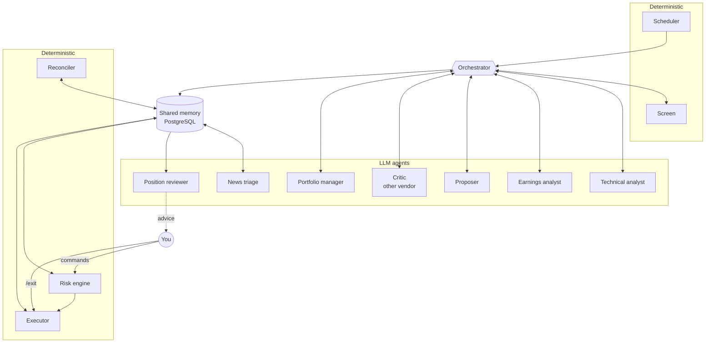
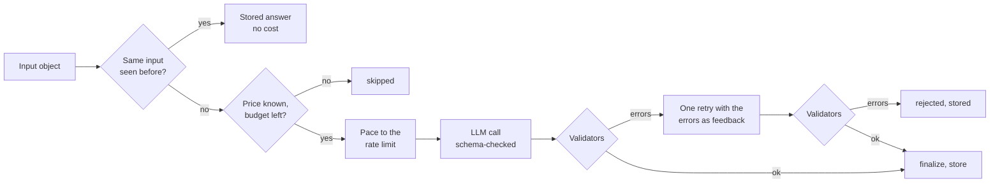
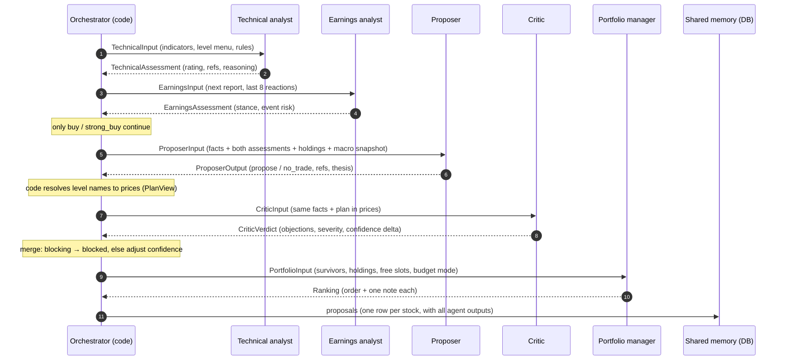

# Trading Agent – Multi-Agent System Design

> How the trading agent works as a multi-agent system (MAS): its architecture, communication, shared memory, coordination, trust, observability and evaluation. Describes the code as of 2026-10-05.
> For the agents' roles in plain language, the authority chain and failure handling, see [HOW-IT-WORKS.md](HOW-IT-WORKS.md) section 8. For the trading workflow and settings, see the rest of that guide. Build details are in [IMPLEMENTATION.md](IMPLEMENTATION.md).

---

## Contents

- [Trading Agent – Multi-Agent System Design](#trading-agent--multi-agent-system-design)
  - [Contents](#contents)
  - [1. Overview](#1-overview)
  - [2. Agent inventory](#2-agent-inventory)
  - [3. Classification](#3-classification)
  - [4. Anatomy of an LLM agent](#4-anatomy-of-an-llm-agent)
  - [5. Communication](#5-communication)
  - [6. Shared memory](#6-shared-memory)
  - [7. Coordination and conflict resolution](#7-coordination-and-conflict-resolution)
  - [8. Trust and containment](#8-trust-and-containment)
  - [9. Fault tolerance](#9-fault-tolerance)
  - [10. Observability and reproducibility](#10-observability-and-reproducibility)
  - [11. Evaluation](#11-evaluation)
  - [12. Design trade-offs and extensions](#12-design-trade-offs-and-extensions)
  - [13. Code map](#13-code-map)

---

## 1. Overview

The system is a **hybrid, hierarchical multi-agent system with central orchestration**. Several agents each do one job, and together they reach a decision none of them makes alone: whether to buy a stock, at which prices, and in which order.

- **Seven LLM agents** bring judgement: analysing a setup, proposing a trade, criticising it, ranking, sorting news and reviewing positions.
- **Five deterministic agents** bring exactness: screening, risk checks and sizing, order execution, reconciliation and timing.
- **One human agent**, you, holds the final authority.

The guiding principle: **LLM agents decide what to think, deterministic agents decide what to do.** No LLM answer can turn into an order unless a deterministic agent checks and approves it.

---

## 2. Agent inventory

| Agent | Kind | Input message | Output message | Model role |
|---|---|---|---|---|
| Scheduler | Deterministic | Exchange calendars, `config/schedule.yaml` | Starts stages at fixed times | – |
| Screen | Deterministic | Daily bars of the universe | Top N candidates per market | – |
| Technical analyst | LLM | `TechnicalInput` | `TechnicalAssessment` | `analysis` |
| Earnings analyst | LLM | `EarningsInput` | `EarningsAssessment` | `analysis` |
| Proposer | LLM | `ProposerInput` | `ProposerOutput` | `proposer` |
| Critic | LLM | `CriticInput` | `CriticVerdict` | `critic` (other vendor) |
| Portfolio manager | LLM | `PortfolioInput` | `Ranking` | `proposer` |
| Risk engine | Deterministic | `Proposal`, portfolio and market state, limits | `RiskDecision` | – |
| Executor | Deterministic | `BracketRequest`, broker state | Orders, fills, stop moves, exits | – |
| Reconciler | Deterministic | Broker positions, agent book | Halt on any mismatch | – |
| News triage | LLM | `TriageInput` | `TriageOutput` | `triage` |
| Position reviewer | LLM | `ReviewInput` | `ReviewOutput` | `analysis` |
| You | Human | Telegram messages, dashboard | Commands, labels, settings | – |

Models per role are set in `config/models.yaml` (currently Gemini 3.8 Flash, Gemini 3.1 Flash-Lite for triage, and Claude Sonnet 5.5 for the critic once an Anthropic key exists).

---

## 3. Classification

| Kind | Agents | Strength | Weakness covered by the others |
|---|---|---|---|
| **LLM agents** (7) | Technical analyst, earnings analyst, proposer, critic, portfolio manager, news triage, position reviewer | Judgement: weighing mixed signals, explaining a decision in words | Can invent facts and miscalculate, and they're non-deterministic |
| **Deterministic agents** (5) | Screen, risk engine, executor, reconciler, scheduler | Exact, repeatable, testable, cheap | Can't weigh soft evidence |
| **Human agent** (1) | You | Final authority, common sense, accountability | Limited time (about 1 hour a day) |

How the system fits the usual MAS dimensions:

| Dimension | This system | Why |
|---|---|---|
| Topology | **Orchestrator–worker**. One orchestrator (`pipeline.py`, started by the scheduler) calls each agent and routes its answer onwards. | A fixed, auditable path from data to order |
| Authority | **Hierarchical with a veto chain**. Lower agents can only stop a trade; only the risk engine approves, and you can override everything ([HOW-IT-WORKS.md](HOW-IT-WORKS.md) 8.2). | Safety: no single AI answer can cause an order |
| Interaction patterns | **Pipeline** (analysts → proposer), **generator–critic** (proposer vs. critic, one round), **aggregator** (portfolio manager), **monitor–advisor** (triage → reviewer → you) | Each pattern does one job: specialise, challenge, prioritise, watch |
| Agent state | **Stateless agents, shared stateful memory**. No agent keeps anything between runs; everything lives in the database (section 6). | Restarts lose nothing, and every run can be replayed |
| Heterogeneity | Different roles, prompts, output schemas, models, and vendors (Gemini vs. Claude for the critic) | Different models make different mistakes, so a critic from another vendor catches more |
| Environment | The market, seen only through daily data that code prepared; the broker, which only deterministic agents touch | Agents perceive facts but can't act on the world directly |
| Autonomy | **Bounded**. Each agent decides freely, but only within its output schema: for example a menu of level names, or `propose` / `no_trade`. | The space of possible actions is small and fully checkable |

**Why orchestrated instead of free conversation.** Frameworks like AutoGen or CrewAI let agents talk to each other in open-ended chats. Here the workflow is the same every day, so a fixed pipeline is cheaper (a known number of calls per stock), reproducible (same input, same path), testable (CI drives the whole pipeline with fake models), and safer (no agent can talk another one into something). The "debate" is deliberately one round: the proposer proposes, the critic objects, and code merges the result.

---

## 4. Anatomy of an LLM agent

Every LLM agent is built from the same parts, and all of them run through one shared runtime, the **runner** (`llm/runner.py`):

| Part | Where | Purpose |
|---|---|---|
| Role prompt | `prompts/<role>/v<N>.md` | Instructions and a checklist; versioned, with a front matter that names the role and output |
| Input schema | Pydantic model, for example `ProposerInput` | Exactly the facts this agent may see, nothing more |
| Output schema | Pydantic model, for example `ProposerOutput`, `CriticVerdict` | The only shape the answer may take. Level names are a `Literal` built from today's menu, so a made-up name fails validation. |
| Validators | `validate()` per agent | Checks that a schema can't express: stop < entry < target, R:R, stop distance, consistency (e.g. the critic's overall severity must equal its worst objection) |
| Finaliser | `finalize()` per agent | Caps applied before storing, e.g. confidence at most 0.5 if the text quotes numbers not found in the input |
| Model role | `config/models.yaml` | Which model runs the agent; swapping a model is a one-line change |

Agents have **no tools**. Instead of letting an agent fetch data on its own (tool calling), the orchestrator pushes all facts in with the input ("context injection"). An agent can't look up something unexpected, every input is stored in full, and a run can be replayed exactly.

---

## 5. Communication

**Agents never talk to each other directly.** Every message goes through the orchestrator as a typed, validated object (JSON on the wire, Pydantic in code). The orchestrator decides what each agent gets to see and often translates between them.

| Message | From → to | Content | What the orchestrator adds or removes |
|---|---|---|---|
| `TechnicalInput` | code → technical analyst | Indicators, level menu, plan rules | Computed by calculators; the analyst never sees raw price history |
| `EarningsInput` | code → earnings analyst | Next report, last 8 reports with surprise and price reaction | History is cut at the scan date, so no future data leaks in |
| `ProposerInput` | technical + earnings → proposer | Both assessments, the menu, rules, holdings, unknown fields, `MacroSnapshot` (since prompt v2) | Holdings come from the agent's own book; the macro snapshot (benchmark trend, VIX, rates, credit spreads) is computed by code from shared memory and cut at the scan date |
| `CriticInput` | proposer → critic | The proposer's facts plus `PlanView` | **Translation**: level names become prices, R:R and stop-in-ATR are computed, so the critic judges numbers rather than names |
| `PortfolioInput` | proposer + critic → portfolio manager | One `Candidate` per survivor: confidence, R:R, thesis, critic severity and summary; free slots; budget mode | **Filtering**: only the summary of the debate, not the full analyses |
| `Proposal` | orchestrator → risk engine (via DB) | Refs, prices, confidence, rank, status | The risk engine ignores the text and checks numbers only |
| `RiskDecision`, `BracketRequest` | risk engine → executor | Every check result, quantity, prices, expiry | The only path to an order |
| `TriageInput` / `TriageOutput` | news → triage → DB | Headlines as `<untrusted>` text, plus the position's thesis and invalidation | Text is cleaned and truncated first |
| `ReviewInput` / `ReviewOutput` | DB → reviewer → you | Position facts, triaged news, thesis | The result goes to you as 🧐 advice, never to the executor |

Three channels, by timing:

1. **Synchronous, inside a scan**: request and answer in a fixed order, one stock after another, paced to each model's rate limit.
2. **Asynchronous, through shared memory**: stages that run at different times communicate by writing to and reading from the database. The scan writes proposals at 08:15, and the risk engine reads them at 09:15. Triage labels news every 30 minutes, and the reviewer reads the labels at 21:00. This is the **blackboard** pattern: producers and consumers never need to run at the same time, and a restart between them loses nothing.
3. **Human channel**: Telegram. Alerts and digests go out; commands, buttons and free-text label reasons come in. Only your chat id is accepted.

The only multi-turn conversation in the system is the **corrective retry**: if an answer fails validation, the runner sends the agent its own answer back with the list of errors, once.

---

## 6. Shared memory

The agents themselves are **stateless**: every run starts with an empty context and only knows what its input contains. The system's memory is one shared PostgreSQL database that all agents read from and write to through code. It serves as the blackboard, the long-term memory and the audit trail at once.

| Memory type | Tables | Holds | Written by | Read by |
|---|---|---|---|---|
| **Working memory** | none (the input object) | The facts for the current call; message history only for the one corrective retry | Orchestrator | The agent being called |
| **World knowledge** (facts) | `instruments`, `bars_daily`, `earnings_events`, `fx_daily`, `macro_series`, `news` | Market data with source and timestamp | Ingestion jobs; triage adds a relevance label to `news` | Screen (also the quality checks and the optional regime gate), calculators, proposer (macro snapshot), risk engine, books, reviewer |
| **Episodic memory** (what agents thought) | `analyses` | Every agent run: full input, output, validation issues, status, model, prompt version, cost | Runner (every LLM agent) | Runner (cache), dashboard, `/why`, eval export |
| **Deliberation record** | `proposals` | One row per stock and scan day: final status, prices, confidence, rank, critique summary, all agent outputs, links to the analyses | Orchestrator | Risk engine, shadow book, `/proposals`, `/review`, triage and reviewer (thesis), weekly report (calibration) |
| **Action memory** (what was done) | `risk_decisions`, `brackets`, `orders`, `fills`, `trades`, `equity_daily` | Every check result, order, fill, round trip and daily account value | Risk engine, executor, end-of-day job | Risk engine (loss limits, holdings), end-of-day job (loss limits at the close), proposer and portfolio manager (holdings, free slots), reconciler, reports |
| **Shared control state** | `kill_switch` | active / paused / halted, reason, until when, hashed reset code | Control center: you, loss-limit trips, reconciliation | Risk engine before every decision, `/status` |
| **Shared resource** | `llm_calls` | Tokens, cost, latency and errors of every call | Runner | Budget guard: every agent draws from one monthly budget |
| **Procedural memory** (how to act) | `prompts/`, `config/` (files, versioned in git) | Role instructions and rules | You, through reviewed commits | Every agent and the risk engine at start |
| **Feedback memory** | `user_labels`, `reports` | Your agree/disagree labels with reasons; weekly reports | You (`/review`), weekly job | Weekly report, dashboard |
| **Audit memory** | `audit_log` | Append-only record of every state change (orders, brackets, kill switch) | Executor, control center | You, for investigations |

Design rules for the shared memory:

- **Agents never write memory directly.** They return an object; code validates it and stores it. That keeps every write well-formed and attributable to an agent, a model and a prompt version.
- **Memory carries intent across time.** The proposer's thesis and invalidation are written once, at the scan. Weeks later, the news triage and the position reviewer read them to judge whether the reason for the trade still holds. The proposer and the reviewer never run at the same time; they communicate through memory.
- **Memoisation.** Each analysis is keyed by a hash of agent, prompt version, model, scan date and full input. A re-run with the same input returns the stored answer at no cost, which makes re-runs cheap and their results identical.
- **One row per decision.** A re-run of the same scan day updates the stock's proposal in place, so your labels and later references stay attached to it.
- **Concurrency.** One process writes, in short transactions. The kill switch row is locked while it changes, and orders carry a unique reference (`<proposal id>:<kind>`), so a retry can never place an order twice.
- **What agents deliberately don't remember.** No agent reads its own past answers or outcomes, so there is no self-learning loop. With a few dozen trades, an agent learning from its own results would mostly learn noise. Learning happens outside the agents: you read the weekly report and your labels, then change a prompt or rule as a new version, and the next reports compare the versions.

---

## 7. Coordination and conflict resolution

- **Time-based coordination.** No agent decides when to act. The scheduler starts every stage at a fixed point relative to the exchange's open or close ([HOW-IT-WORKS.md](HOW-IT-WORKS.md) section 4), so stages never overlap and always run in the same order.
- **Conditional routing.** The orchestrator decides who runs next, from the previous answer: only `buy` / `strong_buy` reach the proposer; only `propose` reaches the critic; the portfolio manager runs only if at least two proposals survive. This saves calls and money.
- **Conflicts are settled by rules, not votes.** Critic `blocking` beats the proposer. Otherwise the critic's confidence change is added to the proposer's confidence. The portfolio manager can reorder but not remove. The risk engine overrides every AI decision, and you override the risk engine.
- **Shared resources.** Free position slots, cash and the AI budget are shared by all agents. The orchestrator tells the portfolio manager how many slots are free and which budget mode is on. Lean mode at 80 % shrinks the number of candidates for every scan.

| Level | Can stop a trade? | Can force a trade? |
|---|---|---|
| Screen | Yes: a stock that isn't picked is never analysed | No |
| Analysts | Yes: a rating below `buy`, or "wait until after the report" | No |
| Proposer | Yes: `no_trade` | No |
| Critic | Yes: `blocking` | No |
| Portfolio manager | No, it can only rank | No |
| Risk engine | Yes: any of 9 checks | It approves, but only what the agents proposed, and only within the limits |
| Kill switch | Yes: paused or halted means no new entries | No |
| You | Yes: `/pause`, `/stop`, settings | No: there is no manual buy. `/exit` is the only manual order. |

---

## 8. Trust and containment

In a multi-agent system, one agent's mistake can cascade through the others. This system treats every LLM answer as **untrusted input**:

| Risk | Defence |
|---|---|
| An agent invents a fact or price | Prices come only from the level menu, enforced by the output schema. Numbers in free text must appear in the input, or the confidence is capped. |
| A bad answer cascades | Every answer is validated before any other agent sees it. Failures stop at that stock. |
| Agents agree on the same mistake | The critic comes from another vendor and gets the plan in prices, not the proposer's reasoning steps |
| An agent gains capabilities it shouldn't have | LLM agents have no tools and no broker access. `import-linter` contracts in CI forbid the `llm`, `modules` and `agents` packages from importing `risk` or `execution`. An approved order can only be built by the risk engine. |
| Prompt injection through news | News reaches only the triage and review agents, wrapped in `<untrusted>` blocks, cleaned and truncated. Both can only give advice; neither can reach an order. |
| Runaway cost | One shared monthly budget, per-model pacing, a fixed number of calls per stock, and memoisation |

---

## 9. Fault tolerance

Each failure stays local and the system degrades in steps instead of stopping:

| Failure | Effect |
|---|---|
| HTTP 429 or 5xx from a model provider | The runner retries after 20 s and 60 s. Token usage is recorded even for failed calls. |
| An answer fails the schema | PydanticAI retries up to twice within the call |
| An answer fails the validators | One corrective retry with the errors fed back; then stored as `rejected`. A rejected technical analysis or proposal skips that stock today. |
| The critic fails | The proposal stays `proposed`, marked "no critique" |
| The portfolio manager fails | The orchestrator ranks by confidence × R:R |
| No price configured for a model, or the budget is used up | The agent is `skipped`; no call is made. At 100 % of the budget no agent runs, and the rule-based book keeps trading in simulation. |
| The process restarts mid-scan | Finished analyses are in the cache, so a re-run continues at no cost; proposals are upserted per stock and day |
| A stage misses its time | It runs late only within its grace period; a late order placement is skipped |

---

## 10. Observability and reproducibility

- **Every agent run is a stored record**: input, output, issues, status, model, prompt version and cost (`analyses`), plus every API call with tokens, latency and errors (`llm_calls`).
- **Every proposal links to the analyses behind it**, so a trade can be traced back to the exact prompts, inputs and answers. `/why SYMBOL` in Telegram shows the thesis, critique and plan; the dashboard's Proposals and Analyses pages show the full trace.
- **Structured logs** summarise each stage (`scan.done`, `proposals.done`, `place.done`), including candidates, statuses, skip reasons and cost.
- **Replays**: the same input gives the same stored answer, and changing a prompt version or a model gives a new key. Comparisons between versions are clean.

---

## 11. Evaluation

| Question | How it's answered |
|---|---|
| Do the agents add value at all? | **Ablation**: `baseline_sim` is the same screen with no agents. The agent books must beat it after fees and AI costs ([HOW-IT-WORKS.md](HOW-IT-WORKS.md) section 9). |
| Are there enough trades to tell? | `agent_shadow` simulates every proposal the risk engine would approve, ignoring the 4-slot limit |
| Is the agents' confidence meaningful? | **Calibration** in the weekly report: do 40 % proposals win about 40 % of the time? |
| Does a human agree with the agents? | Your `/review` labels, compared with the outcomes |
| Does each agent behave? | 30 **golden cases** from real days (`tests/evals`), run against the real models, check schema, validators and plausibility per agent |
| Does the system work together? | Integration tests run the whole pipeline with fake models (PydanticAI `FunctionModel`) in CI, at no cost and with no API key. `llm/fake.py` is a rule-following fake for every agent; with `LLM_FAKE=true` the local stack (`compose.dev.yaml`) runs the full schedule offline |
| Is the baseline a fair bar? | `baseline_sim` and the backtest apply the risk engine's rules, including the correlation cap and the loss limits ([IMPLEMENTATION.md](IMPLEMENTATION.md) 6.2) |
| Can the safety layer be trusted? | The risk engine has 100 % branch coverage and property-based tests: no approved decision may ever break a limit |

The stored data also allows per-agent questions that the weekly report doesn't compute yet. For example: how did the trades the critic blocked turn out? Did its confidence changes improve calibration? Does the portfolio manager's order beat ranking by confidence × R:R?

---

## 12. Design trade-offs and extensions

| Choice | Alternative | Why this way, for now |
|---|---|---|
| Fixed pipeline, one critic round | Open multi-agent chat, multi-round debate | Cost known in advance, reproducible, testable; longer debates can be added later as a new prompt version |
| Facts pushed in, no tools | Agents call read-only tools (`get_bars`, `get_news`) | Every input is stored and replayable; nothing unexpected gets fetched |
| Stateless agents, shared database | Agents with their own long-term memory or reflection | Small samples make self-learning noisy; changes stay in your hands, versioned |
| One process, asyncio | Distributed agents, message broker | 8 GB laptop, one user, a few hundred calls a day |
| Plain Python orchestration with PydanticAI | LangGraph, CrewAI, AutoGen | The graph is small and fixed; fewer dependencies, full control over validation |

Natural next steps for the showcase: a macro-regime agent (today the macro snapshot is code-computed context for the proposer, plus an optional rule-based regime gate in the screen) and a news agent inside the scan, a second critic round when the critic raises a `major` objection, read-only tools for the proposer, and per-agent attribution in the weekly report.

---

## 13. Code map

| MAS concept | Where in the code |
|---|---|
| Orchestrator (scan) | `src/trading_agent/pipeline.py` (`propose`, `rank`, `build_proposal`) |
| Orchestrator (positions) | `src/trading_agent/review.py` (news triage, position review) |
| Scheduler | `src/trading_agent/scheduler.py`, `config/schedule.yaml` |
| Agent runtime | `src/trading_agent/llm/runner.py` (cache, budget, pacing, validation, retry, storage) |
| LLM agents | `src/trading_agent/modules/{technical,earnings,news_triage,position_review}.py`, `src/trading_agent/agents/{proposer,critic,portfolio}.py` |
| Role prompts | `prompts/<role>/v<N>.md` |
| Model registry, budget | `config/models.yaml`, `src/trading_agent/llm/{models,budget}.py` |
| Untrusted text | `src/trading_agent/llm/sanitize.py` |
| Screen | `src/trading_agent/strategies/pullback.py`, `src/trading_agent/backtest.py` (`latest_setups`, regime gate), `src/trading_agent/jobs.py` (`candidates`: drops blocked and blacklisted symbols) |
| Macro context | `src/trading_agent/calc/macro.py`, `src/trading_agent/pipeline.py` (`macro_context`) |
| Risk engine | `src/trading_agent/risk/engine.py`, `config/risk.yaml` |
| Executor | `src/trading_agent/executor.py`, `src/trading_agent/trading.py` |
| Reconciler | `src/trading_agent/execution/reconcile.py`, `src/trading_agent/broker.py` |
| Shared control state | `src/trading_agent/controls.py`, `src/trading_agent/risk/kill_switch.py` |
| Shared memory | `src/trading_agent/db/models.py` and the repositories in `src/trading_agent/db/` |
| Human channel | `src/trading_agent/notify/telegram.py`, `src/trading_agent/journal.py` |
| Containment contracts | `[tool.importlinter]` in `pyproject.toml` |
| Tests | `tests/integration/test_pipeline.py` (whole pipeline, fake models), `tests/evals/` (golden cases), `tests/unit/risk/` (risk engine) |
| Offline fake agents | `src/trading_agent/llm/fake.py`, `compose.dev.yaml`, `make dev-up` |
