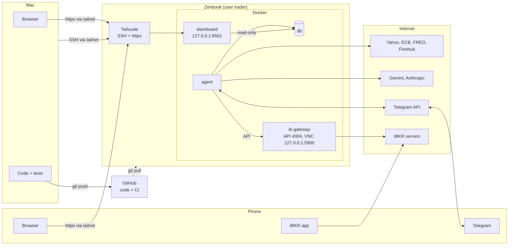

# Running the Trading Agent

What you do, in order, to run the app, and what every step does. [HOW-IT-WORKS.md](HOW-IT-WORKS.md) explains how the system behaves once it runs. [IMPLEMENTATION.md](IMPLEMENTATION.md) 15.5 is the short checklist of the same steps with the outputs to report back (📋).

---

## 1. Where what runs and how to reach it

### 1.1 The machines

| Where | What happens there |
|---|---|
| **Mac** | You (and Copilot) change the code in `~/Projects/trading-agent`, run the tests and push to GitHub. No keys, no passwords, no trading. |
| **GitHub** | Holds the code (private repo `klausrossmann/trading-agent`). CI checks every push (lint, types, tests, Docker build); a failed run sends you an e-mail. |
| **Zenbook** | Runs the app around the clock in Docker, under the user `trader`, in `~/projects/trading-agent`. Only this machine has `.env` (keys) and `secrets/` (passwords). Your normal desktop user keeps browsing as before. |
| **IBKR** | The paper account on IBKR's servers. The IB Gateway on the Zenbook logs in to it; the agent talks only to the gateway. |
| **Phone** | Telegram (messages and commands), the IBKR app (2FA, manual emergency exits), the dashboard over Tailscale. |

The app is four Docker containers on the Zenbook, started together with Docker Compose:

| Container | What it does |
|---|---|
| `db` | PostgreSQL: all prices, analyses, proposals, orders, trades and settings. Its data survives restarts and rebuilds (Docker volume `pgdata`). |
| `agent` | The app itself: scheduler, data jobs, AI agents, risk engine, simulator or IBKR orders, Telegram bot. |
| `dashboard` | The read-only web dashboard (Streamlit). |
| `ib-gateway` | IBKR's gateway program with an auto-login helper (IBC). Started only with `COMPOSE_PROFILES=ibkr`. |



Nothing on the Zenbook accepts connections from the internet or the home network. You reach it only through your private Tailscale network (tailnet), and the containers publish their ports only on the Zenbook itself (`127.0.0.1`). The agent and the gateway make outgoing connections only: market data, AI providers, Telegram, IBKR.

### 1.2 How to reach each part

| What | Runs where | From the Zenbook | From the Mac | From the phone |
|---|---|---|---|---|
| **Telegram bot** | `agent` container (polls Telegram, no open port) | Telegram | Telegram | Telegram. Only your chat (`TELEGRAM_OWNER_CHAT_ID`) is answered. |
| **Dashboard** | `dashboard` container, port 8501 on `127.0.0.1` | Browser: `http://localhost:8501` | Browser with Tailscale on: the `https://….ts.net` address that `tailscale serve status` shows | Same address, Tailscale app on. No login: the tailnet is the lock. |
| **Shell on the Zenbook** | Zenbook | Terminal, then `sudo -iu trader` | `ssh zenbook` (or `ssh trader@100.116.207.96`), Tailscale on | Optional: an SSH app over Tailscale |
| **Agent log** | `agent` container | `cd ~/projects/trading-agent && make logs` | `ssh zenbook`, then the same | |
| **Database** | `db` container, port 5432 only inside Docker | `docker compose exec db psql -U dashboard -d trading` (read-only); `-U agent` can change data, so only with care | via `ssh zenbook` | Use the dashboard |
| **Gateway screen (VNC)** | `ib-gateway` container, port 5900 on `127.0.0.1` | Remmina: VNC, `localhost:5900` | `ssh -L 5901:localhost:5900 zenbook`, then `open vnc://localhost:5901` | |
| **Gateway API** | `ib-gateway`, port 4004 only inside Docker | Through the agent only (`trading-agent ibkr-check`) | | |
| **IBKR account** | IBKR's servers | Client Portal in the browser | Client Portal | IBKR app (also 2FA and emergency exits) |
| **Code** | GitHub; copies on the Mac and the Zenbook | `git pull` (read-only deploy key) | `~/Projects/trading-agent`, `git push` | |
| **CI results** | GitHub Actions | | github.com/klausrossmann/trading-agent/actions, or the failure e-mail | E-mail |
| **Heartbeat** | e.g. healthchecks.io | | Its website | Its alert e-mail when the agent stops pinging |
| **Backups** | Zenbook: `backups/` (14 days), `backups/offsite/*.age` (weekly, encrypted) | `ls backups/` | Copy an `.age` file off the machine; the decryption key is on the Mac (`~/.config/age/key.txt`) | |

The VNC password is the first 8 characters of `secrets/vnc_password`: `head -c 8 secrets/vnc_password; echo` as `trader`.

### 1.3 Ports

| Port | Who listens | Reachable from |
|---|---|---|
| 22 (SSH) | Zenbook | The tailnet only (`ufw` blocks the home network) |
| 443 (https) | Tailscale on the Zenbook, forwarding to 8501 | The tailnet only |
| 8501 | `dashboard` | The Zenbook itself (`127.0.0.1`) |
| 5900 | `ib-gateway` VNC | The Zenbook itself (`127.0.0.1`) |
| 4004 | `ib-gateway` API (paper) | Other containers only. The API has no password, so it's never published. |
| 5432 | `db` | Other containers only |

The local test stack on the Mac (`make dev-up`) uses its own ports: dashboard `127.0.0.1:8502`, database `127.0.0.1:55433`.

### 1.4 Logins and where they're kept

| Login | Stored where | Used for |
|---|---|---|
| IBKR username and password | `.env` (`TWS_USERID`) and `secrets/tws_password` on the Zenbook | The gateway's automatic login (paper mode) |
| Database passwords | `secrets/postgres_password`, `agent_db_password`, `dashboard_db_password` | Each container reads only its own |
| VNC password | `secrets/vnc_password` | Viewing the gateway's screen |
| API keys (Gemini, FRED, Finnhub, Telegram bot, heartbeat) | `.env` on the Zenbook | The agent's outgoing calls |
| GitHub deploy key | `~trader/.ssh/` on the Zenbook | Reading the repo for `git pull` |
| Backup decryption key | `~/.config/age/key.txt` on the Mac, plus your password manager | Restoring an off-site backup |

`.env` and `secrets/` never go to GitHub (`.gitignore`) and are readable only by `trader`.

Every command below runs on the Zenbook as `trader` in `~/projects/trading-agent`, unless it says "on the Mac". `sudo -iu trader` switches to that user from your desktop user.

---

## 2. One-time setup

### Step 1: Prepare the Zenbook

The details are in [IMPLEMENTATION.md](IMPLEMENTATION.md) 15.1. In short:

| Action | Why |
|---|---|
| A separate user `trader`, the only one in the `docker` group | Docker access equals root rights. Your normal desktop user never sees the keys or passwords. |
| Sleep and lid-close suspend disabled | A trading robot that sleeps misses its jobs. |
| Time zone `Europe/Berlin`, NTP on | All schedules are in Berlin time and follow the exchange calendars. |
| Docker Engine with the Compose plugin, log rotation | Runs the containers; rotation keeps logs from filling the disk. |
| 4 GB swap | The stack plus the IB Gateway needs about 3.5 GB of memory; swap covers peaks. |
| Tailscale and `openssh-server`, `ufw` allowing only the tailnet | You reach the Zenbook (SSH, dashboard) only through your private Tailscale network, never from the internet or the home network. |
| Automatic security updates | Patches without your attention, with reboots at 04:00, outside all trading jobs. |

### Step 2: Get the code

```sh
ssh-keygen -t ed25519                     # then add ~/.ssh/id_ed25519.pub on GitHub: repo → Settings → Deploy keys (read-only)
git clone git@github.com:klausrossmann/trading-agent.git ~/projects/trading-agent
cd ~/projects/trading-agent
git config pull.ff only
```

- The **deploy key** lets the Zenbook read the private repository, and only that repository, without your GitHub password. Read-only means a compromised Zenbook can't change your code.
- `pull.ff only` makes `git pull` refuse instead of mixing changes when the Zenbook's copy was edited locally. The Zenbook only ever receives code; it never changes it (see 6.1 if it refuses).

### Step 3: Create the passwords

```sh
make secrets
```

Creates random passwords in `secrets/` for the database superuser, the agent's database login, the dashboard's read-only login and the VNC viewer of the gateway. Existing files are kept, so it's safe to run again. Each container reads only its own password file; no password is ever in `.env` or in a log.

### Step 4: Fill in `.env`

```sh
cp .env.example .env && chmod 600 .env
nano .env
```

`.env` holds the switches and API keys. `chmod 600` makes it readable only by `trader`. Fill in:

| Key | Where to get it | What it's for |
|---|---|---|
| `TELEGRAM_BOT_TOKEN` | Telegram: `@BotFather` → `/newbot` | Your private bot for messages and commands. Leave `TELEGRAM_OWNER_CHAT_ID` empty for now (step 8). |
| `GEMINI_API_KEY` | aistudio.google.com → Get API key | The AI agents (Gemini). The free tier is enough at first. |
| `LLM_DEV_OVERRIDES=true` | | The critic runs on Gemini until you add an Anthropic key. |
| `FRED_API_KEY` | fred.stlouisfed.org → My Account → API Keys (free) | US macro data: rates, VIX, credit spreads for the proposer's market snapshot. Without it these stay empty. |
| `FINNHUB_API_KEY` | finnhub.io → Dashboard (free) | News on the stocks the agent holds, for news triage and position review. |
| `HEARTBEAT_URL` (optional) | e.g. healthchecks.io, a check with a 15-minute grace period | The agent pings it every 5 minutes; if the pings stop, the service e-mails you. This is how you notice that the whole machine is down. |

Leave the IBKR lines as they are for now (step 10). `APP_MODE` stays `paper`.

### Step 5: Build and create the database

```sh
make build
docker compose up -d db
make migrate
```

- `make build` builds the app's Docker image from the code: Python, all libraries and the app. Takes 5–15 minutes the first time, under a minute later when only code changed.
- `docker compose up -d db` starts PostgreSQL. On its first start it creates the database and the agent and dashboard logins.
- `make migrate` creates or updates the tables (Alembic migrations). Safe to repeat: it only applies what's missing.

### Step 6: Load the market data

```sh
docker compose run --rm agent trading-agent backfill
docker compose run --rm agent trading-agent backfill      # second run: should change nothing
docker compose run --rm agent trading-agent quality
```

- `backfill` loads the stock universe (S&P 100, DAX 40, two benchmark ETFs), 6 years of daily prices from Yahoo, EUR/USD from the ECB, macro series from FRED and the earnings calendar. A few minutes.
- The second run proves the import is **idempotent**: it reports zero inserts and updates. That matters because the daily jobs re-run the same import.
- `quality` lists data problems (missing days, impossible prices, big jumps). Stocks with a recent problem are left out of the scan.
- `docker compose run --rm agent ...` starts a throwaway copy of the agent container for one command and removes it afterwards; the running agent isn't affected.

### Step 7: Start the app

```sh
make up
make logs          # wait for "agent.started", then Ctrl-C (the agent keeps running)
```

`make up` starts all containers in the background. `restart: unless-stopped` means Docker restarts them after a crash or a reboot, until you stop them yourself. `make logs` follows the agent's log.

### Step 8: Connect Telegram

```sh
# send your bot any message in Telegram, then:
docker compose logs agent | grep telegram.ignored        # shows your chat_id
nano .env                                                # TELEGRAM_OWNER_CHAT_ID=<that number>
docker compose up -d agent
```

The bot ignores every chat except the owner's, so it first ignores you too and logs your chat id. After you enter it, `docker compose up -d agent` recreates the agent container with the new `.env`; a plain `restart` would keep the old values. Test in Telegram: `/status`, `/briefing`, `/budget`.

### Step 9: Publish the dashboard

```sh
curl -s localhost:8501/_stcore/health                   # prints "ok"
sudo tailscale serve --bg 8501
tailscale serve status                                  # shows the https://….ts.net address
```

The dashboard listens only on the Zenbook itself. `tailscale serve` makes it reachable at a private HTTPS address inside your tailnet, from the phone (Tailscale app on) or the Mac, and nowhere else. The setting survives reboots.

### Step 10: Connect the IBKR paper account

```sh
make secrets                     # adds secrets/vnc_password if missing
make tws-password                # type your IBKR password (not echoed); stored in secrets/tws_password
nano .env
```

In `.env`:

| Key | Value | Why |
|---|---|---|
| `TWS_USERID` | your normal IBKR username | The gateway logs in with it **in paper mode** (fixed in `compose.yaml`), so it reaches the paper account (ID starting with `DU`). The separate paper username was rejected. |
| `COMPOSE_PROFILES` | `ibkr` | Starts the `ib-gateway` container together with the others. |
| `IB_ENABLED` | `true` | The agent connects to the gateway: account and positions, contract ids, quotes, reconciliation. |
| `IB_ORDERS_ENABLED` | `false` | Orders still go to the simulator. Switch later (section 5). |
| `IB_READ_ONLY_API` | `yes` | The gateway itself refuses all orders: a second lock while orders are simulated. |

Then:

```sh
docker compose up -d
docker compose logs -f ib-gateway | grep -v "Connection refused"     # wait for "Login has completed"; confirm 2FA on the phone
docker compose run --rm -e IB_CLIENT_ID=12 agent trading-agent ibkr-check
```

- "Connection refused" lines are normal while the gateway is still logging in: the agent keeps trying until the gateway's API is up.
- `ibkr-check` connects with client id 12 because the running agent already uses 11, and IBKR allows each id only once. It prints the account (paper: about €1,000,000 play money; the agent uses only its own €1,000 / €5,000 budgets), positions, IBKR's daily prices next to Yahoo's, quotes and price increments. Run it while the markets are open to see delayed quotes.
- Telegram `/status` should now show `IB Gateway: connected`.
- The gateway restarts every night at 23:45 by itself. About once a week IBKR asks for a full login: confirm the 2FA prompt on your phone.
- Using your normal username has one side effect: a login with the same username elsewhere (IBKR app, Client Portal) can log the gateway out. Later, a second IBKR user only for the API avoids this.
- The paper account must not hold positions the agent didn't open; otherwise the reconciliation halts the agent.

### Step 11: Set up backups

On the Mac:

```sh
brew install age && mkdir -p ~/.config/age && age-keygen -o ~/.config/age/key.txt
```

On the Zenbook:

```sh
sudo apt install age
nano .env                  # BACKUP_AGE_RECIPIENT=age1… (the public key printed on the Mac)
make backup                # prints "backup ok: …"
crontab -e                 # add: 15 3 * * * cd ~/projects/trading-agent && scripts/backup.sh >> backups/backup.log 2>&1
```

- `make backup` dumps the database into `backups/` and checks that the dump is readable. 14 days are kept.
- The cron line runs it every night at 03:15. On Sundays it also writes an encrypted copy to `backups/offsite/`. Only the private key on your Mac (keep a copy in your password manager) can decrypt it, so you can store that copy anywhere off the machine.
- `make restore-check FILE=backups/<file>.dump` restores a backup into a scratch database and deletes it again: proof that the backup really works.

### Step 12: Prepare the Mac for updates

Add to `~/.ssh/config` on the Mac:

```
Host zenbook
    HostName 100.116.207.96
    User trader
```

The address is the Zenbook's Tailscale IP (`tailscale ip -4` on the Zenbook); the Mac needs Tailscale too. Then `ssh zenbook` works, and so does `make deploy` (section 4).

---

## 3. Daily operation

Once running, the app needs no buttons. The daily schedule is in [HOW-IT-WORKS.md](HOW-IT-WORKS.md) section 4: scans before each open, placement 15 minutes after it, end-of-day processing after each close, the 🌙 evening digest, the Saturday report.

Your part (about an hour a day, [HOW-IT-WORKS.md](HOW-IT-WORKS.md) 11.4):

| When | What you do | Why |
|---|---|---|
| Morning | Read the 📰 briefing and the 🧠 EU proposals; `/pause` if something looks wrong | `/pause` stops the 09:15 placement and all new entries until `/resume` |
| Evening | Read the 🌙 digest, `/review` the day's proposals, check 🧐 advice and decide on `/exit` | Your labels measure whether the AI's judgement matches yours; `/exit` is the only manual sale |
| Saturday | Read the weekly report | Shows the go-live gate and which prompt or rule might need a change |
| About once a week | Confirm the IBKR 2FA prompt when it comes | Otherwise the gateway stays logged out (🔌 alert after 10 minutes) |

### Commands you'll use

| Command (on the Zenbook) | What it does |
|---|---|
| `docker compose ps` | Shows which containers run and whether they restart in a loop |
| `make logs` | Follows the agent's log (Ctrl-C ends only the view) |
| `docker compose logs --since 2h ib-gateway \| grep -v "Connection refused"` | The gateway's recent log without the noise |
| `docker compose up -d` | Starts everything, or recreates containers whose settings (`.env`, image) changed |
| `docker compose restart agent` | Restarts the agent with unchanged settings |
| `make down` | Stops everything (data stays). `make up` starts it again. |
| `docker compose run --rm agent trading-agent propose --market US` | Runs the US agent pipeline now: proposals, no orders |
| `docker compose run --rm -e IB_CLIENT_ID=12 agent trading-agent place US` | Runs today's US placement now. Safe to repeat: nothing is ordered twice. |
| `docker compose run --rm agent trading-agent weekly-report` | Builds and sends the weekly report now |
| `docker compose run --rm agent trading-agent backtest` | Backtests the rule-based strategy on the stored data |
| `docker compose run --rm agent trading-agent reset` | After a halt: prints a code; send `/reset CODE` in Telegram within 15 minutes |

In Telegram: `/status`, `/positions`, `/pnl`, `/proposals`, `/why SYMBOL`, `/review`, `/pause`, `/resume`, `/stop`, `/exit SYMBOL`, `/help`.

---

## 4. Updating the app

1. **On the Mac**: change the code, `make lint && make test`, commit, push. GitHub CI runs the same checks; wait for the green tick (or watch for the failure e-mail).
2. **Deploy**, outside trading sessions or after `/pause`:
   - from the Mac: `make deploy`, or
   - on the Zenbook: `git pull && make build && make migrate && make up`.
3. **Check**: `/status` in Telegram, `make logs` for errors. `/resume` if you paused.

What each part does: `git pull` fetches the new code, `make build` builds a new image from it, `make migrate` updates the tables if the update needs it, `make up` replaces the running containers with the new image. A restart triggers a reconciliation with IBKR, which is why deploys happen outside sessions.

Changes to `.env` need only `docker compose up -d` (no build). Changes in `config/` or `prompts/` are part of the image: commit, push, deploy.

---

## 5. Checklist: from setup to real money

Section 2 gets the app running. These checks prove that it works, in this order. Tick them off as you go; the 📋 outputs in [IMPLEMENTATION.md](IMPLEMENTATION.md) 15.5 are what to send back.

**Setup (section 2)**

- [ ] Steps 1–9: Zenbook prepared, data loaded, app running, Telegram answers `/status`, dashboard opens on the phone
- [x] Step 10: IBKR paper account connected; `ibkr-check` shows delayed quotes (2026-10-05)
- [ ] Step 11: backups set up, `make restore-check` passed
- [ ] Step 12: `ssh zenbook` works from the Mac

**First days**

- [ ] **Gateway survives the night**: the morning after step 10, `docker compose logs --since 12h ib-gateway | grep -v "Connection refused" | tail -50` shows the 23:45 restart and a new login without your help. Proves the gateway runs unattended.
- [ ] **AI scan works**: `docker compose run --rm agent trading-agent analyse --top 3` prints a rating, a plan and the cost per stock. Proves the Gemini key, the budget guard and the analysts.
- [ ] **Proposals**: `docker compose run --rm agent trading-agent propose --market US`, then `/proposals`, `/why SYMBOL`, `/review` in Telegram. From then on the scans run by themselves before each open.
- [ ] **Kill switch**: `/pause test`, `/status`, `/resume`, then `/stop` and confirm; `docker compose run --rm agent trading-agent reset` prints a code; `/reset CODE`. `/status` shows `Kill switch: active`. Proves you can stop the agent and only you can restart it.
- [ ] **Simulated orders**: on the next trading days, 📤 messages 15 minutes after each open, 🟢 🔴 ⌛ after each close, and the 🌙 digest. Send the first two days. Proves the whole chain from scan to order runs.
- [ ] **One week of proposals, labelled by you** with `/review`. Gives the first evidence whether the AI's judgement matches yours.

**Before real orders at IBKR**

- [ ] **IBKR orders and the three chaos tests** (gateway restart with open orders, reboot during a session, replaying the same proposals): [IMPLEMENTATION.md](IMPLEMENTATION.md) 15.5 step 17. Prerequisites: the gateway ran a few days without problems and `/positions` shows nothing open. Proves that no order is lost, duplicated or left without a stop.
- [ ] Optional: Anthropic key for the critic, then `LLM_DEV_OVERRIDES=false` ([HOW-IT-WORKS.md](HOW-IT-WORKS.md) 12.2).

**Paper phase and go-live**

- [ ] **3 months of paper trading** with the daily routine (section 3) until the weekly report shows the go-live gate met: 91 days, 50 closed trades, positive after all costs, better than the rule-based book.
- [ ] **Go-live checklist**: mini PC, funded live account, interlock and kill switch tested live, restore tested on another machine ([IMPLEMENTATION.md](IMPLEMENTATION.md) section 18).

---

## 6. Troubleshooting

### 6.1 `git pull` says "divergent branches" or refuses

Something was changed or committed on the Zenbook. The Zenbook should only receive code, so reset it to GitHub's state (`.env`, `secrets/`, `backups/` and the database aren't touched):

```sh
git fetch origin && git reset --hard origin/main
```

### 6.2 The gateway doesn't log in

| Symptom | Meaning and fix |
|---|---|
| Only "Connection refused" lines for more than 5 minutes | The login didn't finish. Look at the gateway's screen (6.3). |
| "Invalid username or password" (on the gateway screen) | Wrong username or password: check `TWS_USERID` in `.env` and run `make tws-password` again, then `docker compose up -d --force-recreate ib-gateway`. Stop the gateway (`docker compose stop ib-gateway`) while you sort it out; repeated failures can lock the login. |
| Waits for "second factor" | Confirm the 2FA prompt in the IBKR app. |
| "Existing session" | The same username is logged in elsewhere; log out there. |

### 6.3 Seeing the gateway's screen

The gateway runs a small screen you can view with VNC. On the Zenbook's desktop: open **Remmina**, protocol VNC, server `localhost:5900`. The password is the first 8 characters of the VNC secret:

```sh
sudo head -c 8 ~trader/projects/trading-agent/secrets/vnc_password; echo
```

From the Mac (with Tailscale): `ssh -L 5901:localhost:5900 zenbook`, then `open vnc://localhost:5901`.

### 6.4 `ibkr-check` fails with "API connection failed: TimeoutError"

The running agent already uses client id 11. Run the check with its own id: `-e IB_CLIENT_ID=12`.

### 6.5 Errors 10089 / 354 about market data

The account has no paid real-time data for the API. The app asks for free delayed quotes (15–20 minutes old) and uses the last close when none arrive. Nothing to fix.

### 6.6 No Telegram messages

`docker compose ps` (is the agent running?), `make logs` (errors?), `TELEGRAM_OWNER_CHAT_ID` set? After changing `.env`: `docker compose up -d agent`.

### 6.7 CI failure e-mail after a push

Open the run on GitHub (Actions tab). If a step like "Set up job" failed, it's the CI setup, not your code; otherwise the failing check (lint, types, tests) shows what to fix. Run `make lint && make test` on the Mac to reproduce it.
