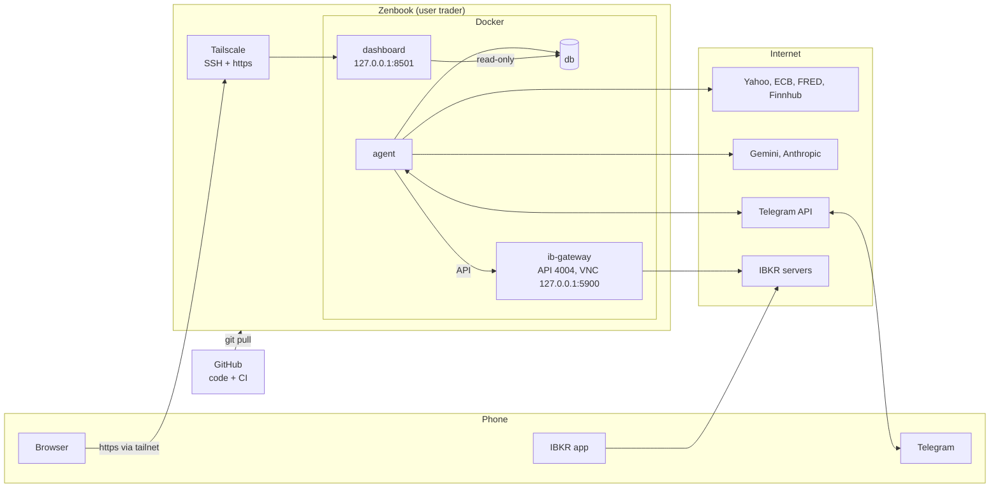

# Running the Trading Agent

Everything you do on the Zenbook, step by step, and what each step does:

1. [Where what runs and how to reach it](#1-where-what-runs-and-how-to-reach-it)
2. [One-time setup](#2-one-time-setup)
3. [Starting the app](#3-starting-the-app)
4. [Testing that everything works](#4-testing-that-everything-works)
5. [Daily operation](#5-daily-operation)
6. [Updating the app](#6-updating-the-app)
7. [Troubleshooting](#7-troubleshooting)

[HOW-IT-WORKS.md](HOW-IT-WORKS.md) explains how the system behaves once it runs.

Every command runs on the Zenbook as the user `trader`, in the folder `~/projects/trading-agent`. From your normal desktop user:

```sh
sudo -iu trader                 # become trader (the only user allowed to run Docker and read the keys)
cd ~/projects/trading-agent     # the app's folder: code, .env, secrets/, backups/
```

---

## 1. Where what runs and how to reach it

### 1.1 The parts

| Where | What happens there |
|---|---|
| **Zenbook** | Runs the app around the clock in Docker, under the user `trader`. Only this machine has `.env` (API keys and switches) and `secrets/` (passwords). Your normal desktop user keeps browsing as before. |
| **GitHub** | Holds the code (private repo `klausrossmann/trading-agent`). The Zenbook downloads it with `git pull`. CI checks every change; a failed check sends you an e-mail. |
| **IBKR** | The paper account on IBKR's servers. The IB Gateway on the Zenbook logs in to it; the agent talks only to the gateway. |
| **Phone** | Telegram (messages and commands), the IBKR app (2FA, emergency exits), the dashboard over Tailscale. |

The app is four Docker containers on the Zenbook, started together with Docker Compose:

| Container | What it does |
|---|---|
| `db` | PostgreSQL: all prices, analyses, proposals, orders, trades and settings. Its data survives restarts and rebuilds (Docker volume `pgdata`). |
| `agent` | The app itself: scheduler, data jobs, AI agents, risk engine, simulator or IBKR orders, Telegram bot. |
| `dashboard` | The read-only web dashboard (Streamlit). |
| `ib-gateway` | IBKR's gateway program with an auto-login helper (IBC). Started only with `COMPOSE_PROFILES=ibkr` in `.env`. |



Nothing on the Zenbook accepts connections from the internet or the home network. Other devices reach it only through your private Tailscale network (tailnet), and the containers publish their ports only on the Zenbook itself (`127.0.0.1`). The agent and the gateway only make outgoing connections: market data, AI providers, Telegram, IBKR.

### 1.2 How to reach each part

| What | Runs where | On the Zenbook | From the phone (or any device in your tailnet) |
|---|---|---|---|
| **Telegram bot** | `agent` container (polls Telegram, no open port) | Telegram | Telegram. Only your chat (`TELEGRAM_OWNER_CHAT_ID`) is answered. |
| **Dashboard** | `dashboard` container, port 8501 on `127.0.0.1` | Browser: `http://localhost:8501` | The `https://….ts.net` address that `tailscale serve status` shows, with Tailscale on. No login: the tailnet is the lock. |
| **Shell** | Zenbook | Terminal, then `sudo -iu trader` | Optional: an SSH app to `trader@100.116.207.96` (the Zenbook's Tailscale address, `tailscale ip -4`) |
| **Agent log** | `agent` container | `make logs` | |
| **Database** | `db` container, port 5432 only inside Docker | `docker compose exec db psql -U dashboard -d trading` (read-only); `-U agent` can change data, so only with care | Use the dashboard |
| **Gateway screen (VNC)** | `ib-gateway` container, port 5900 on `127.0.0.1` | Remmina: protocol VNC, server `localhost:5900` | |
| **Gateway API** | `ib-gateway`, port 4004 only inside Docker | Through the agent only (`trading-agent ibkr-check`) | |
| **IBKR account** | IBKR's servers | Client Portal in the browser | IBKR app (also 2FA and emergency exits) |
| **Code** | GitHub; a copy on the Zenbook | `git pull` (read-only deploy key) | |
| **CI results** | GitHub Actions | github.com/klausrossmann/trading-agent/actions | The failure e-mail |
| **Heartbeat** | e.g. healthchecks.io | Its website | Its alert e-mail when the agent stops pinging |
| **Backups** | `backups/` (14 days) and `backups/offsite/*.age` (weekly, encrypted) | `ls backups/ backups/offsite/` | Copy the `.age` files to any cloud drive; they're encrypted |

The VNC password is the first 8 characters of `secrets/vnc_password`. As `trader`: `head -c 8 secrets/vnc_password; echo`. From your desktop user: `sudo head -c 8 ~trader/projects/trading-agent/secrets/vnc_password; echo`.

### 1.3 Ports

| Port | Who listens | Reachable from |
|---|---|---|
| 22 (SSH) | Zenbook | The tailnet only (`ufw` blocks the home network) |
| 443 (https) | Tailscale on the Zenbook, forwarding to 8501 | The tailnet only |
| 8501 | `dashboard` | The Zenbook itself (`127.0.0.1`) |
| 5900 | `ib-gateway` VNC | The Zenbook itself (`127.0.0.1`) |
| 4004 | `ib-gateway` API (paper) | Other containers only. The API has no password, so it's never published. |
| 5432 | `db` | Other containers only |

### 1.4 Logins and where they're kept

| Login | Stored where | Used for |
|---|---|---|
| IBKR username and password | `.env` (`TWS_USERID`) and `secrets/tws_password` | The gateway's automatic login (paper mode) |
| Database passwords | `secrets/postgres_password`, `agent_db_password`, `dashboard_db_password` | Each container reads only its own |
| VNC password | `secrets/vnc_password` | Viewing the gateway's screen |
| API keys (Gemini, FRED, Finnhub, Telegram bot, heartbeat) | `.env` | The agent's outgoing calls |
| GitHub deploy key | `~trader/.ssh/` | Reading the repo for `git pull` |
| Backup decryption key | Only in your password manager, never on the Zenbook | Restoring an encrypted off-site backup |

`.env` and `secrets/` never go to GitHub (`.gitignore`) and are readable only by `trader`.

---

## 2. One-time setup

Done once per machine. Steps 1–10 are done on this Zenbook; step 11 (backups) is still open.

### Step 1: Prepare the Zenbook

The details are in [IMPLEMENTATION.md](IMPLEMENTATION.md) 15.1. In short:

| Action | Why |
|---|---|
| A separate user `trader`, the only one in the `docker` group | Docker access equals root rights. Your normal desktop user never sees the keys or passwords. |
| Sleep and lid-close suspend disabled | A trading robot that sleeps misses its jobs. |
| Time zone `Europe/Berlin`, NTP on | All schedules are in Berlin time and follow the exchange calendars. |
| Docker Engine with the Compose plugin, log rotation | Runs the containers; rotation keeps logs from filling the disk. |
| 4 GB swap | The app plus the IB Gateway needs about 3.5 GB of memory; swap covers peaks. |
| Tailscale and `openssh-server`, `ufw` allowing only the tailnet | Other devices reach the Zenbook (SSH, dashboard) only through your private Tailscale network, never from the internet or the home network. |
| Automatic security updates | Patches without your attention, with reboots at 04:00, outside all trading jobs. |

### Step 2: Get the code

```sh
ssh-keygen -t ed25519                     # then add ~/.ssh/id_ed25519.pub on GitHub: repo → Settings → Deploy keys (read-only)
git clone git@github.com:klausrossmann/trading-agent.git ~/projects/trading-agent
cd ~/projects/trading-agent
git config pull.ff only
```

- The **deploy key** lets the Zenbook read the private repository, and only that repository, without your GitHub password. Read-only means a compromised Zenbook can't change your code.
- `pull.ff only` makes `git pull` refuse instead of mixing changes when the Zenbook's copy was edited locally. The Zenbook only ever receives code; it never changes it (see 7.1 if it refuses).

### Step 3: Create the passwords

```sh
make secrets
```

Creates random passwords in `secrets/` for the database superuser, the agent's database login, the dashboard's read-only login and the VNC viewer of the gateway. Existing files are kept, so it's safe to run again. Each container reads only its own password file; no password is ever in `.env` or in a log.

### Step 4: Fill in `.env`

```sh
cp .env.example .env && chmod 600 .env
nano .env
```

`.env` holds the switches and API keys. `chmod 600` makes it readable only by `trader`. Write each value directly after the `=`, without quotes, and never put a comment on the same line: Docker Compose reads `KEY=   # text` as the value `# text`. Fill in:

| Key | Where to get it | What it's for |
|---|---|---|
| `TELEGRAM_BOT_TOKEN` | Telegram: `@BotFather` → `/newbot` | Your private bot for messages and commands. Leave `TELEGRAM_OWNER_CHAT_ID` empty for now (step 8). |
| `GEMINI_API_KEY` | aistudio.google.com → Get API key | The AI agents (Gemini). The free tier is enough at first. |
| `LLM_DEV_OVERRIDES=true` | | The critic runs on Gemini until you add an Anthropic key. |
| `FRED_API_KEY` | fred.stlouisfed.org → My Account → API Keys (free) | US macro data: rates, VIX, credit spreads for the proposer's market snapshot. Without it these stay empty. |
| `FINNHUB_API_KEY` | finnhub.io → Dashboard (free) | News on the stocks the agent holds, for news triage and position review. |
| `HEARTBEAT_URL` (optional) | e.g. healthchecks.io, a check with a 15-minute grace period | The agent pings it every 5 minutes; if the pings stop, the service e-mails you. This is how you notice that the whole machine is down. |

Leave the IBKR lines as they are for now (step 10). `APP_MODE` stays `paper`.

### Step 5: Build and create the database

```sh
make build
docker compose up -d db
make migrate
```

- `make build` builds the app's Docker image from the code: Python, all libraries and the app. Takes 5–15 minutes the first time, under a minute later when only code changed.
- `docker compose up -d db` starts PostgreSQL. On its first start it creates the database and the agent and dashboard logins.
- `make migrate` creates or updates the tables. Safe to repeat: it only applies what's missing.

### Step 6: Load the market data

```sh
docker compose run --rm agent trading-agent backfill
docker compose run --rm agent trading-agent backfill      # second run: should change nothing
```

- `backfill` loads the stock universe (S&P 100, DAX 40, two benchmark ETFs), 6 years of daily prices from Yahoo, EUR/USD from the ECB, macro series from FRED and the earnings calendar. A few minutes.
- The second run proves the import is **idempotent**: it reports zero inserts and updates. That matters because the daily jobs re-run the same import.
- `docker compose run --rm agent ...` starts a throwaway copy of the agent container for one command and removes it afterwards; the running agent isn't affected.

### Step 7: Start the app for the first time

```sh
make up
make logs          # wait for "agent.started", then Ctrl-C (the agent keeps running)
```

`make up` starts all containers in the background. `make logs` follows the agent's log. Section 3 explains starting in detail.

### Step 8: Connect Telegram

```sh
# send your bot any message in Telegram, then:
docker compose logs agent | grep telegram.ignored        # shows your chat_id
nano .env                                                # TELEGRAM_OWNER_CHAT_ID=<that number>
docker compose up -d agent
```

The bot ignores every chat except the owner's, so it first ignores you too and logs your chat id. After you enter it, `docker compose up -d agent` recreates the agent container with the new `.env`; a plain `restart` would keep the old values.

### Step 9: Publish the dashboard

```sh
sudo tailscale serve --bg 8501
tailscale serve status                                  # shows the https://….ts.net address
```

The dashboard listens only on the Zenbook itself. `tailscale serve` makes it reachable at a private HTTPS address inside your tailnet, for example from the phone with the Tailscale app on, and nowhere else. The setting survives reboots. `sudo` needs your desktop user (the one with admin rights), not `trader`.

### Step 10: Connect the IBKR paper account

```sh
make secrets                     # adds secrets/vnc_password if missing
make tws-password                # type your IBKR password (not shown); stored in secrets/tws_password
nano .env
```

In `.env`:

| Key | Value | Why |
|---|---|---|
| `TWS_USERID` | your normal IBKR username | The gateway logs in with it **in paper mode** (fixed in `compose.yaml`), so it reaches the paper account (ID starting with `DU`). The separate paper username was rejected. |
| `COMPOSE_PROFILES` | `ibkr` | Starts the `ib-gateway` container together with the others. |
| `IB_ENABLED` | `true` | The agent connects to the gateway: account and positions, contract ids, quotes, reconciliation. |
| `IB_ORDERS_ENABLED` | `false` | Orders still go to the simulator. Switch later (section 4, test 13). |
| `IB_READ_ONLY_API` | `yes` | The gateway itself refuses all orders: a second lock while orders are simulated. |

Then `docker compose up -d` starts the gateway (section 3 shows how to follow its login), and test 5 in section 4 checks the connection.

- The gateway restarts every night at 23:45 by itself. About once a week IBKR asks for a full login: confirm the 2FA prompt on your phone.
- Using your normal username has one side effect: a login with the same username elsewhere (IBKR app, Client Portal) can log the gateway out. Later, a second IBKR user only for the API avoids this.
- The paper account must not hold positions the agent didn't open; otherwise the reconciliation halts the agent.

### Step 11: Set up backups

```sh
sudo apt install age                                       # as your desktop user
age-keygen -o /tmp/age-key.txt                             # as trader; prints "Public key: age1…"
cat /tmp/age-key.txt                                       # copy the whole content into your password manager
shred -u /tmp/age-key.txt                                  # the private key must not stay on the Zenbook
nano .env                                                  # BACKUP_AGE_RECIPIENT=age1… (the public key)
crontab -e                                                 # add the line below
```

```
15 3 * * * cd ~/projects/trading-agent && scripts/backup.sh >> backups/backup.log 2>&1
```

- **age** encrypts files. The **public key** (`age1…`) can only encrypt, so it may sit in `.env`. The **private key** decrypts; it lives only in your password manager. A stolen Zenbook or a leaked off-site copy is useless without it.
- The **cron line** runs `scripts/backup.sh` every night at 03:15. It dumps the database into `backups/` (14 days kept) and checks that each dump is readable. On Sundays it also writes an encrypted copy to `backups/offsite/`; copy those files to any cloud drive.
- Test the backup right away with test 10 in section 4.

---

## 3. Starting the app

The app starts by itself after a reboot or a crash (Docker's `restart: unless-stopped`). Do these steps after `make down`, after an update, or whenever you want to be sure it runs.

**Step 1: Start the containers**

```sh
make up
```

Runs `docker compose up -d`: starts `db`, `agent`, `dashboard` and, with `COMPOSE_PROFILES=ibkr`, `ib-gateway`, all in the background. Containers that already run with unchanged settings are left alone; containers whose `.env` or image changed are recreated.

**Step 2: Check the containers**

```sh
docker compose ps
```

Lists the containers. Expected: all four `Up` (the database `Up (healthy)`). `Restarting` means a container crashes again and again; its log shows why (`docker compose logs <name> | tail -50`).

**Step 3: Follow the gateway's login**

```sh
docker compose logs -f ib-gateway | grep -v "Connection refused"
```

Shows the gateway's log as it happens, without the noise. Wait for `Login has completed` (about 30–90 seconds). If your phone shows an IBKR 2FA prompt, confirm it. "Connection refused" lines, which this command hides, are normal until the login is done: the agent keeps knocking until the gateway's API opens. Ctrl-C ends the view; the gateway keeps running. No `Login has completed` after 3 minutes: see 7.2.

**Step 4: Follow the agent's start**

```sh
make logs
```

Shows the agent's log as it happens. Expected within a minute: `agent.started`, `scheduler.planned` (today's jobs) and `ibkr.connected`. One `ibkr.connect_failed` before that is normal while the gateway is still logging in. Ctrl-C ends the view.

**Step 5: Ask the agent**

In Telegram: `/status`. Expected: mode `paper`, kill switch `active`, the dates of the last prices, the next jobs and `IB Gateway: connected`. This is the quickest check that everything works together; use it whenever you're unsure.

**Stopping the app**

```sh
make down
```

Stops and removes all containers. The database (volume `pgdata`), `.env`, `secrets/` and `backups/` stay; `make up` brings everything back. Stop outside trading sessions: orders already at IBKR stay active there, but nothing on the Zenbook watches them while the app is down.

---

## 4. Testing that everything works

Do these tests once, in this order, after the setup. Each says what to do, what you should see, and what it proves. Repeat a test whenever you suspect a problem in its area.

| # | Test | When | Done |
|---|---|---|---|
| 1 | Containers run | Now | ☐ |
| 2 | Telegram answers | Now | ☐ |
| 3 | Market data is complete | Now | ☐ |
| 4 | Dashboard opens | Now | ☐ |
| 5 | IBKR connection | Now, ideally during market hours | ☑ 2026-10-05 |
| 6 | AI analysts | Now | ☐ |
| 7 | Agent pipeline and labels | Now | ☐ |
| 8 | Briefing and AI budget | Now | ☐ |
| 9 | Kill switch | Outside 09:15 and 15:45 | ☐ |
| 10 | Backup and restore | After step 11 | ☐ |
| 11 | Gateway survives the night | The next morning | ☐ |
| 12 | A full trading day | The next two trading days | ☐ |
| 13 | IBKR orders and chaos tests | After a few stable days | ☐ |
| 14 | Paper phase and go-live gate | 3 months | ☐ |

### Test 1: Containers run

```sh
docker compose ps
```

**Expect** `db`, `agent`, `dashboard` and `ib-gateway` all `Up`. **Proves** the app and its database are running and Docker isn't restarting anything in a loop.

### Test 2: Telegram answers

In Telegram: `/status`, then `/help`.

**Expect** the status (mode `paper`, kill switch `active`, last prices, next jobs, `IB Gateway: connected`) and the command list. **Proves** the bot reaches you, only your chat is accepted, and the agent's scheduler is running.

### Test 3: Market data is complete

```sh
docker compose run --rm agent trading-agent quality
```

Checks every stored price history for missing days, impossible prices (a low above the high), jumps over 40 % and stale data.

**Expect** a short report; ideally no blocked stocks. A few blocked stocks are fine: they're left out of the scan until the problem is 20 sessions old. **Proves** the price data the screen and the AI rely on is sound.

### Test 4: Dashboard opens

```sh
curl -s localhost:8501/_stcore/health          # prints "ok"
tailscale serve status                         # shows the https://….ts.net address
```

Open that address on the phone with the Tailscale app on, then turn Tailscale off and reload.

**Expect** `ok`, the pages filling with data, and no page with Tailscale off. **Proves** the dashboard works and is reachable only through your tailnet.

### Test 5: IBKR connection

```sh
docker compose run --rm -e IB_CLIENT_ID=12 agent trading-agent ibkr-check
```

Connects to the gateway as a second client (id 12; the running agent already uses 11 and IBKR allows each id once) and reads the account, positions, IBKR's daily prices next to the stored ones, live quotes and price increments. It changes nothing.

**Expect** `Account (EUR): net liquidation 1000000.0` (paper play money; the agent only uses its own €1,000 / €5,000 budgets), `Positions: 0`, `Contracts without conid: none`, and during market hours `AAPL: delayed, last …, bid …, ask …`. Outside market hours the quotes may say `no data`. Warnings 10167 ("displaying delayed market data") and `tickType 88` errors are harmless. **Proves** the agent can read the account and get prices for the 1 % entry check.

### Test 6: AI analysts

```sh
docker compose run --rm agent trading-agent analyse --top 3
```

Runs the technical and earnings analysts (Gemini) on today's three strongest setups. Costs a few cents.

**Expect** per stock a rating, a plan (entry, stop, target) and an earnings stance, plus the total cost. **Proves** the Gemini key works and the AI's answers pass the code checks.

### Test 7: Agent pipeline and labels

```sh
docker compose run --rm agent trading-agent propose --market US
```

Runs the whole AI chain for US stocks: screen → analysts → proposer → critic → portfolio manager. It stores proposals but places no orders; the placement only uses that morning's scan, so these proposals are never ordered.

**Expect** ranked proposals, blocked ones and passes, skipped stocks and the cost. Then in Telegram: `/proposals` (the list), `/why SYMBOL` (thesis, critique, plan), `/review` (label one Agree or Disagree, reply with a reason). **Proves** all agents work together and your labels are stored. From now on the scans run by themselves before each open.

### Test 8: Briefing and AI budget

In Telegram: `/briefing`, then `/budget`.

**Expect** the morning briefing (markets, EUR/USD, earnings ahead, the rule-based book, data status) and the AI spend this month against the $16 budget. **Proves** the reports work and the budget guard counts the AI costs.

### Test 9: Kill switch

Outside the placement times (09:15 and 15:45), in Telegram:

1. `/pause test`, then `/status`: shows `paused (test)`. No new entries.
2. `/resume`: entries allowed again.
3. `/stop` and confirm: `/status` shows `halted`. No new entries, unfilled entries cancelled.
4. On the Zenbook: `docker compose run --rm agent trading-agent reset` prints a code.
5. In Telegram within 15 minutes: `/reset CODE`. `/status` shows `Kill switch: active`.

**Proves** you can stop the agent from your phone at any time, and only someone with both the Zenbook and your phone can restart it after a halt. Don't leave it halted: then nothing trades.

### Test 10: Backup and restore

```sh
OFFSITE=1 make backup
make restore-check FILE=$(ls -1t backups/*.dump | head -1)
```

The first command makes a backup now, including an encrypted off-site copy. The second restores the newest backup into a scratch database, prints the row counts and deletes the scratch database again; the real database isn't touched.

Then test the encrypted copy: paste the private key from your password manager into `/tmp/age-key.txt`, and run

```sh
AGE_KEY=/tmp/age-key.txt make restore-check FILE=$(ls -1t backups/offsite/*.age | head -1)
shred -u /tmp/age-key.txt
```

**Expect** `backup ok: …` and twice the row counts of the main tables. **Proves** that backups are written, readable and can be decrypted with the key from your password manager.

### Test 11: Gateway survives the night

The morning after the gateway's first start:

```sh
docker compose logs --since 12h ib-gateway | grep -v "Connection refused" | tail -50
```

**Expect** the restart at 23:45 and a new `Login has completed` without you doing anything (unless IBKR asked for the weekly 2FA). Telegram `/status` shows `IB Gateway: connected`. **Proves** the gateway runs unattended.

### Test 12: A full trading day

Nothing to type; watch Telegram on the next two trading days:

| Time | Expect | Shows that |
|---|---|---|
| 08:15 | 🧠 EU proposals | The EU scan ran by itself |
| 08:30 | 📰 Morning briefing | The daily report works |
| 09:15 | 📤 EU orders (simulator) and rejections with reasons | The risk engine decides and the simulator receives the orders |
| 14:45 | 🧠 US proposals | The US scan ran |
| 15:45 | 📤 US orders | As at 09:15 |
| 18:05 / 22:35 | 🟢 bought, 🔴 sold, ⌛ entry ended (if anything happened) | Fills and exits are processed after each close |
| 23:05 | 🌙 Evening digest | The day's summary, both books, AI spend |

Not every day has proposals or orders; "no trades" is a valid result. The dashboard's Positions and Proposals pages show the same. **Proves** the whole chain from data to order runs on its own.

### Test 13: IBKR orders and chaos tests

After a few days without gateway problems, and when `/positions` shows nothing open: switch the orders from the simulator to the IBKR paper account (`IB_ORDERS_ENABLED=true`, `IB_READ_ONLY_API=no`) and run the three chaos tests (gateway restart with open orders, reboot during a session, replaying the same proposals). Exact steps: [IMPLEMENTATION.md](IMPLEMENTATION.md) 15.5 step 17. **Proves** that no order is lost, duplicated or left without a stop.

### Test 14: Paper phase and go-live gate

Three months of paper trading with the daily routine (section 5), until the Saturday report shows the go-live gate met: 91 days, 50 closed trades, positive after all costs, better than the rule-based book. Real money only follows after the go-live checklist in [IMPLEMENTATION.md](IMPLEMENTATION.md) section 18.

---

## 5. Daily operation

Once running, the app needs no buttons. The daily schedule is in [HOW-IT-WORKS.md](HOW-IT-WORKS.md) section 4: scans before each open, placement 15 minutes after it, end-of-day processing after each close, the 🌙 evening digest, the Saturday report.

Your part (about an hour a day, [HOW-IT-WORKS.md](HOW-IT-WORKS.md) 11.4):

| When | What you do | Why |
|---|---|---|
| Morning | Read the 📰 briefing and the 🧠 EU proposals; `/pause` if something looks wrong | `/pause` stops the 09:15 placement and all new entries until `/resume` |
| Evening | Read the 🌙 digest, `/review` the day's proposals, check 🧐 advice and decide on `/exit` | Your labels measure whether the AI's judgement matches yours; `/exit` is the only manual sale |
| Saturday | Read the weekly report | Shows the go-live gate and which prompt or rule might need a change |
| About once a week | Confirm the IBKR 2FA prompt when it comes | Otherwise the gateway stays logged out (🔌 alert after 10 minutes) |

### Commands you'll use

| Command | What it does |
|---|---|
| `docker compose ps` | Shows which containers run and whether they restart in a loop |
| `make logs` | Follows the agent's log (Ctrl-C ends only the view) |
| `docker compose logs --since 2h ib-gateway \| grep -v "Connection refused"` | The gateway's recent log without the noise |
| `make up` | Starts everything, or recreates containers whose settings (`.env`, image) changed |
| `docker compose restart agent` | Restarts the agent with unchanged settings |
| `make down` | Stops everything (data stays) |
| `docker compose run --rm agent trading-agent propose --market US` | Runs the US agent pipeline now: proposals, no orders |
| `docker compose run --rm -e IB_CLIENT_ID=12 agent trading-agent place US` | Runs today's US placement now. Safe to repeat: nothing is ordered twice. |
| `docker compose run --rm agent trading-agent weekly-report` | Builds and sends the weekly report now |
| `docker compose run --rm agent trading-agent backtest` | Backtests the rule-based strategy on the stored data |
| `docker compose run --rm agent trading-agent reset` | After a halt: prints a code; send `/reset CODE` in Telegram within 15 minutes |

In Telegram: `/status`, `/positions`, `/pnl`, `/proposals`, `/why SYMBOL`, `/review`, `/pause`, `/resume`, `/stop`, `/exit SYMBOL`, `/help`.

---

## 6. Updating the app

When new code is on GitHub (and its CI run is green), outside trading sessions or after `/pause`:

```sh
git pull
make build
make migrate
make up
```

| Command | What it does |
|---|---|
| `git pull` | Downloads the new code from GitHub |
| `make build` | Builds a new image from it (under a minute when only code changed) |
| `make migrate` | Updates the database tables if the update needs it; otherwise does nothing |
| `make up` | Replaces the running containers with ones from the new image |

Then check with `/status` in Telegram and `make logs`, and `/resume` if you paused. A restart triggers a reconciliation with IBKR, which is why updates happen outside sessions.

- Changes to `.env` need only `make up` (no build).
- Changes in `config/` or `prompts/` are part of the code: they come with `git pull` and need the build.
- Updates that only change documentation need just `git pull`.

---

## 7. Troubleshooting

### 7.1 `git pull` says "divergent branches" or refuses

Something was changed or committed on the Zenbook. The Zenbook should only receive code, so reset it to GitHub's state (`.env`, `secrets/`, `backups/` and the database aren't touched):

```sh
git fetch origin && git reset --hard origin/main
```

### 7.2 The gateway doesn't log in

Look at its screen first (7.3), then:

| Symptom | Meaning and fix |
|---|---|
| Only "Connection refused" lines for more than 5 minutes | The login didn't finish; the gateway's screen shows why. |
| "Invalid username or password" | Wrong username or password: check `TWS_USERID` in `.env`, run `make tws-password` again, then `docker compose up -d --force-recreate ib-gateway`. Stop the gateway (`docker compose stop ib-gateway`) while you sort it out; repeated failures can lock the login. |
| Waits for "second factor" | Confirm the 2FA prompt in the IBKR app. |
| "Existing session" | The same username is logged in elsewhere; log out there. |

### 7.3 Seeing the gateway's screen

The gateway runs a small screen you can view with VNC. On the Zenbook's desktop: open **Remmina** (`sudo apt install remmina remmina-plugin-vnc` if missing), protocol VNC, server `localhost:5900`, password from 1.2.

### 7.4 `ibkr-check` fails with "API connection failed: TimeoutError"

The running agent already uses client id 11. Run the check with its own id: `-e IB_CLIENT_ID=12`.

### 7.5 Errors 10089 / 354, warning 10167 about market data

The account has no paid real-time data for the API. The app uses free delayed quotes (15–20 minutes old) and the last close when none arrive. Nothing to fix.

### 7.6 No Telegram messages

`docker compose ps` (is the agent running?), `make logs` (errors?), `TELEGRAM_OWNER_CHAT_ID` set in `.env`? After changing `.env`: `make up`.

### 7.7 CI failure e-mail

The latest code on GitHub failed a check. Don't update the Zenbook to that version; wait until a fix is pushed and the run is green (github.com/klausrossmann/trading-agent/actions).
